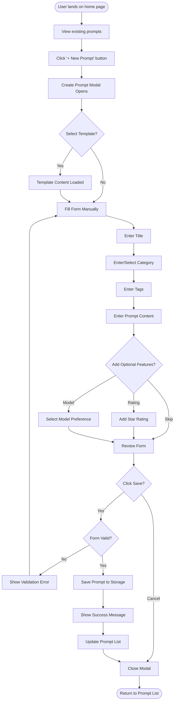
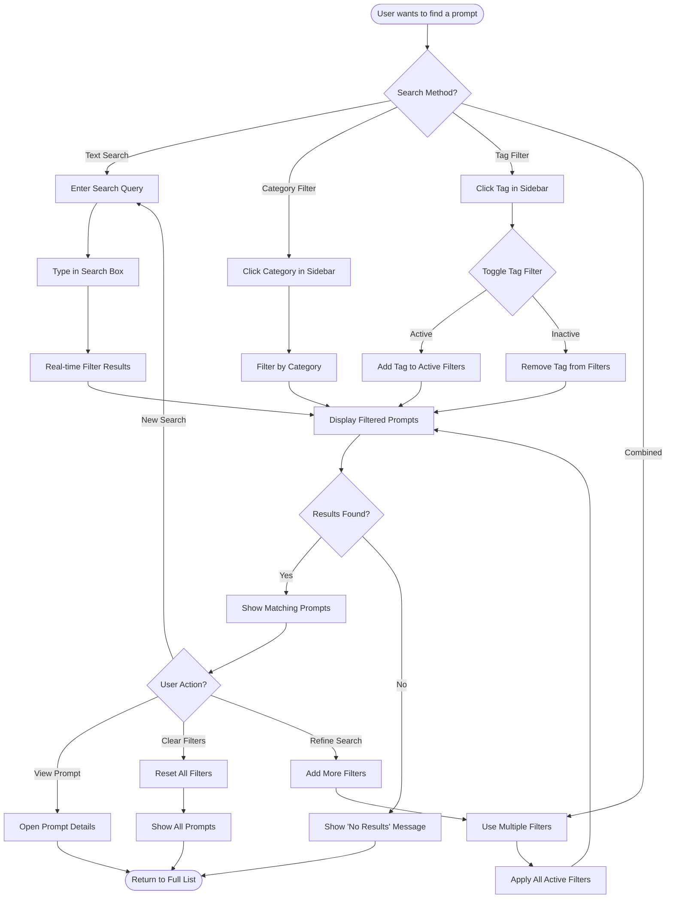
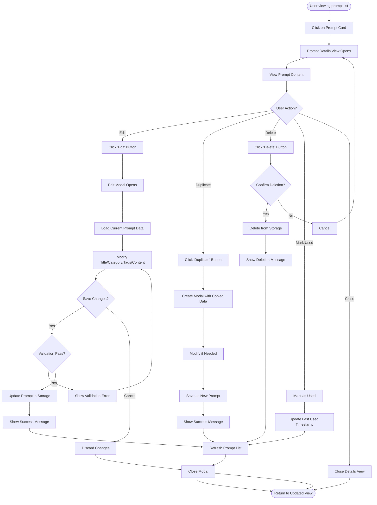
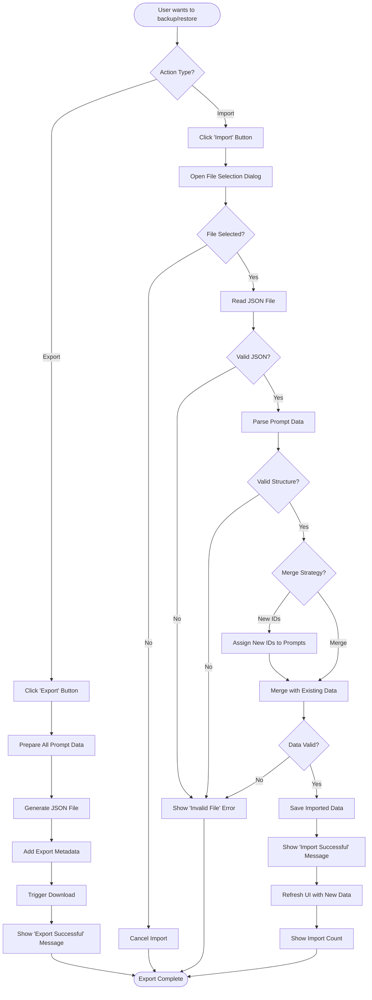
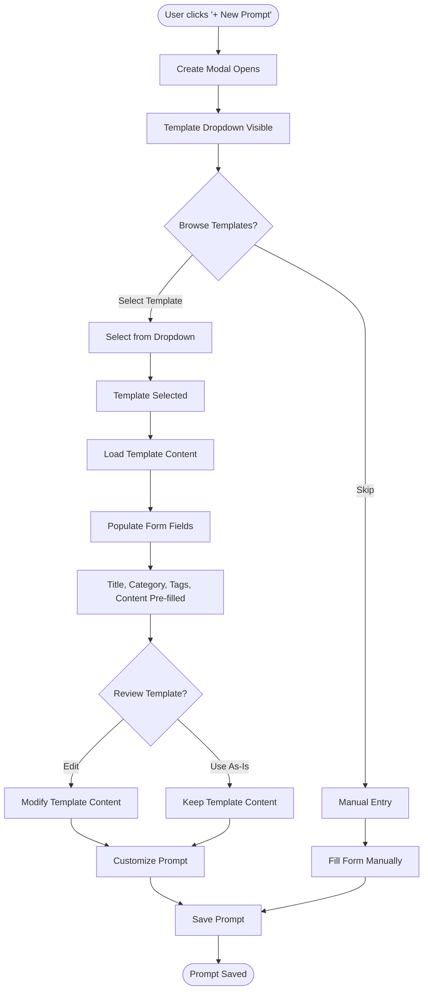
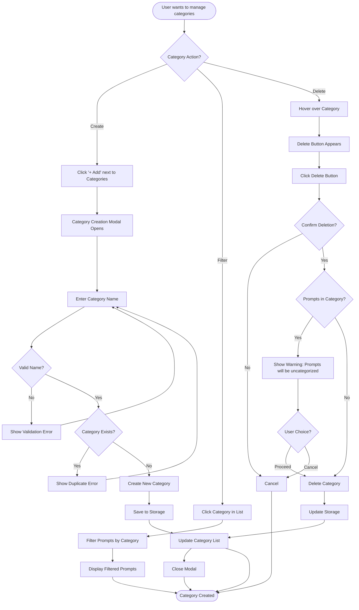
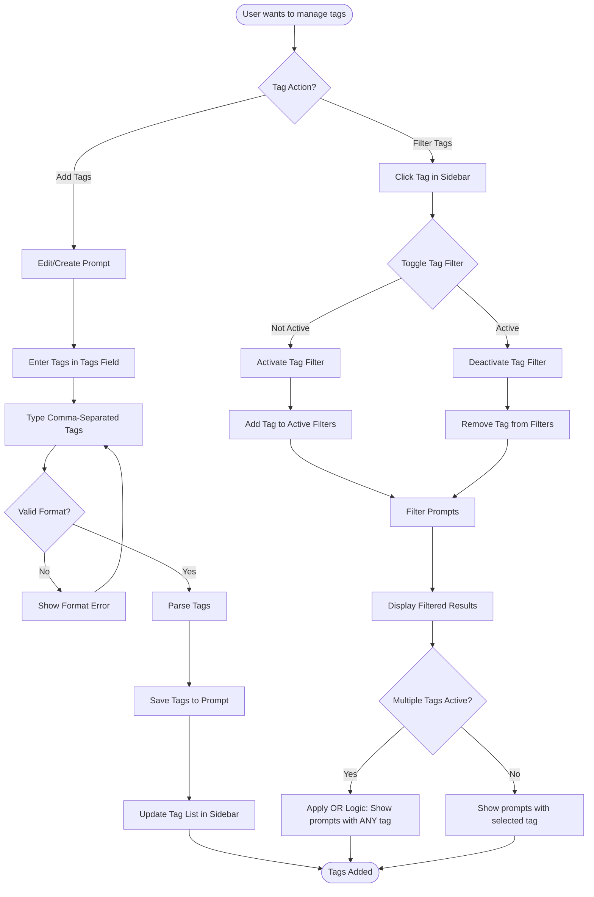
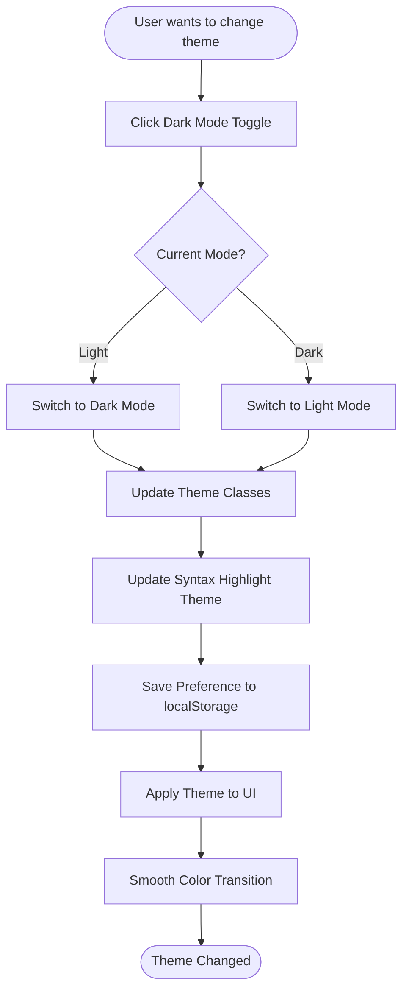
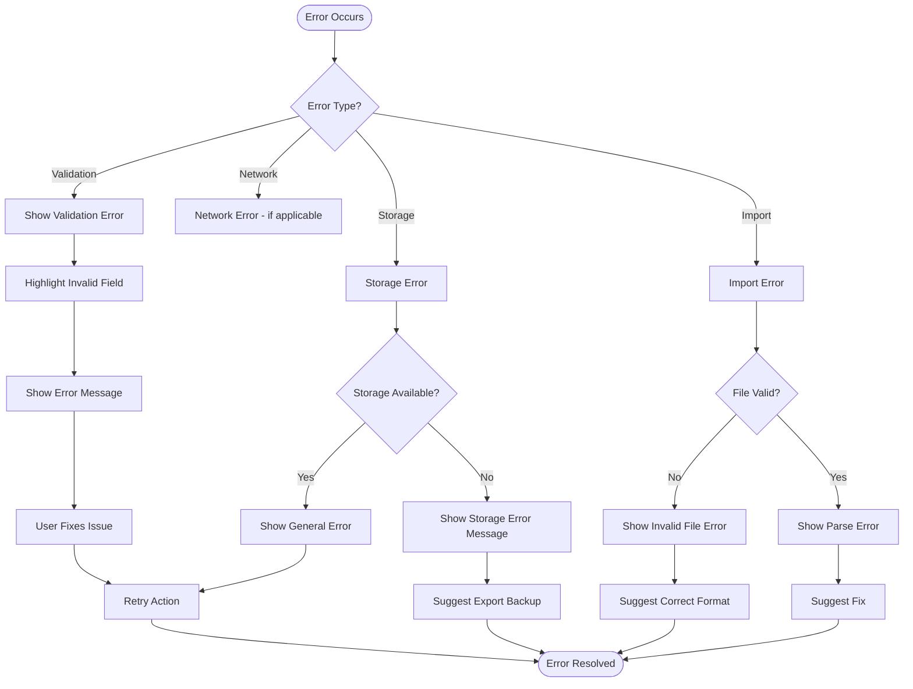

# User Flow Diagrams

## Overview

This document provides visual user flow diagrams using Mermaid syntax for key user interactions in Prompt Vault. These flows map the paths users take to accomplish their goals within the application.

---

## Flow 1: Creating a New Prompt

### Description
Complete flow for creating a new prompt, including optional template selection and form validation.

### Key Decision Points
- **Template Selection**: User can choose to use a template or start from scratch
- **Optional Features**: Rating and model preference are optional
- **Validation**: Form must be validated before saving
- **Cancel**: User can cancel at any time

### Error States
- Title required validation
- Content required validation
- Invalid category format
- Duplicate prompt detection

---

## Flow 2: Searching and Filtering Prompts

### Description
Flow for finding prompts using search, category filters, and tag filters with real-time results.

### Key Features
- **Real-time Search**: Results update as user types
- **Multiple Filter Types**: Search, category, and tags work together
- **Combined Filters**: AND logic for multiple filters
- **Clear Filters**: Easy reset to show all prompts

### Filter Logic
- **Search**: Searches across title, content, tags, and category
- **Category**: Single selection (mutually exclusive)
- **Tags**: Multiple selection (OR logic - shows prompts with ANY selected tag)
- **Combined**: All active filters work together (AND logic)

---

## Flow 3: Editing an Existing Prompt

### Description
Complete flow for viewing, editing, duplicating, and deleting prompts.

### Key Actions
- **Edit**: Modify existing prompt
- **Duplicate**: Create copy for modification
- **Delete**: Remove prompt (with confirmation)
- **Mark Used**: Track usage timestamp
- **Close**: Return to list view

### Safety Features
- Confirmation dialog for delete
- Validation before save
- Option to discard changes

---

## Flow 4: Import/Export Workflow

### Description
Complete flow for backing up and restoring prompt data through import/export functionality.

### Export Features
- Includes all prompts and categories
- Adds export timestamp
- Generates downloadable JSON file
- Shows success confirmation

### Import Features
- Validates JSON structure
- Assigns new IDs to prevent conflicts
- Merges with existing data
- Shows import count
- Error handling for invalid files

---

## Flow 5: Template Selection and Usage

### Description
Flow for browsing and using prompt templates from the template library.

### Template Categories
- **CRISPE Framework**: Professional templates
- **ELAVIS Framework**: Content creation templates
- **SPARC Framework**: Documentation templates

### Template Features
- Pre-fills form fields
- User can modify before saving
- Clear template names and descriptions
- Organized by framework type

---

## Flow 6: Category Management

### Description
Flow for creating, organizing, and deleting categories.

### Category Features
- Create new categories on-the-fly
- Filter prompts by category
- Delete categories (with warning if prompts exist)
- Categories persist across sessions

---

## Flow 7: Tag Management and Filtering

### Description
Flow for adding tags to prompts and filtering by tags.

### Tag Features
- Comma-separated tag input
- Auto-complete from existing tags
- Multiple tags per prompt
- OR logic for multiple tag filters
- Visual indication of active tag filters

---

## Flow 8: Dark Mode Toggle

### Description
Simple flow for toggling between light and dark themes.

### Dark Mode Features
- Persistent preference (saved to localStorage)
- Smooth transitions
- Syntax highlighting theme updates
- Immediate visual feedback

---

## Flow 9: Error Handling and Recovery

### Description
Flow for handling errors and providing recovery paths.

### Error Types
- **Validation Errors**: Form field validation
- **Storage Errors**: localStorage issues
- **Import Errors**: Invalid JSON or file format
- **General Errors**: Unexpected errors

### Recovery Paths
- Clear error messages
- Actionable suggestions
- Retry mechanisms
- Backup recommendations

---

## Flow Summary Table

| Flow | Primary User Goal | Key Decision Points | Error States |
|------|------------------|---------------------|--------------|
| Create Prompt | Add new prompt | Template selection, validation | Required fields, duplicates |
| Search/Filter | Find prompts | Filter type, combination | No results |
| Edit Prompt | Modify existing | Save vs cancel, delete confirm | Validation errors |
| Import/Export | Backup/restore | File selection, merge strategy | Invalid file format |
| Template Usage | Use template | Template selection, modification | Template not found |
| Category Management | Organize prompts | Create, filter, delete | Duplicate, in-use |
| Tag Management | Add filters | Tag input, filter toggle | Invalid format |
| Dark Mode | Change theme | Light/dark toggle | None |
| Error Handling | Recover from errors | Error type, recovery path | Multiple error types |

---

## Next Steps

- Validate flows with user testing
- Identify edge cases and exceptions
- Create detailed error state flows
- Design recovery paths for each error
- Document keyboard shortcuts and accessibility flows

---

**Document Version**: 2.0  
**Last Updated**: 2024  
**Status**: Updated based on current implementation

