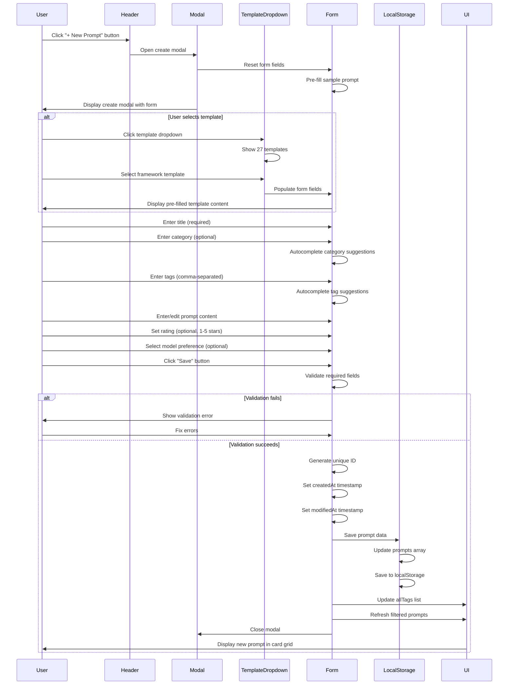
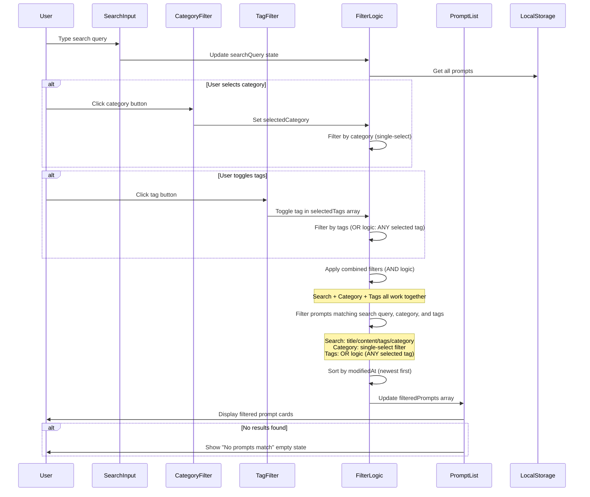
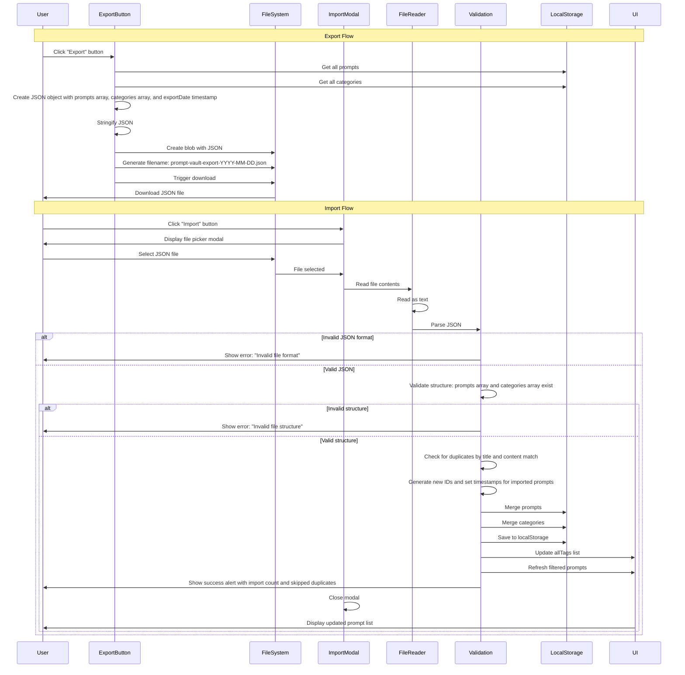
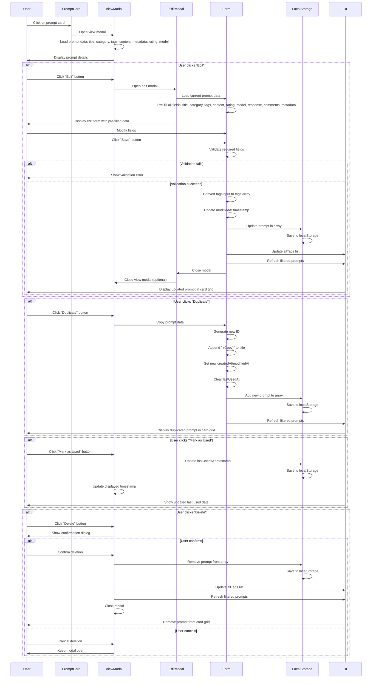
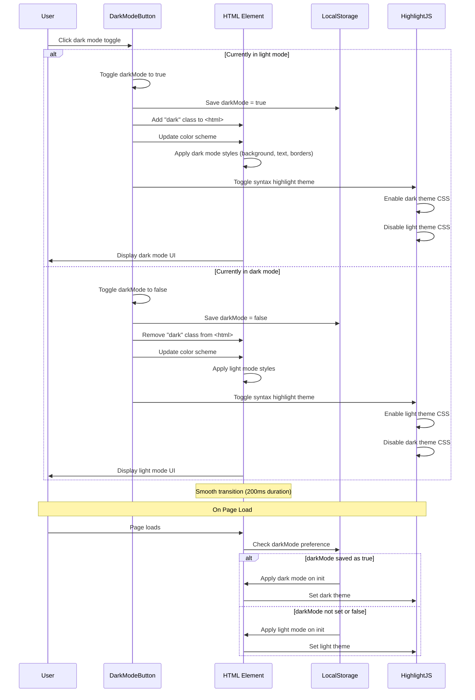
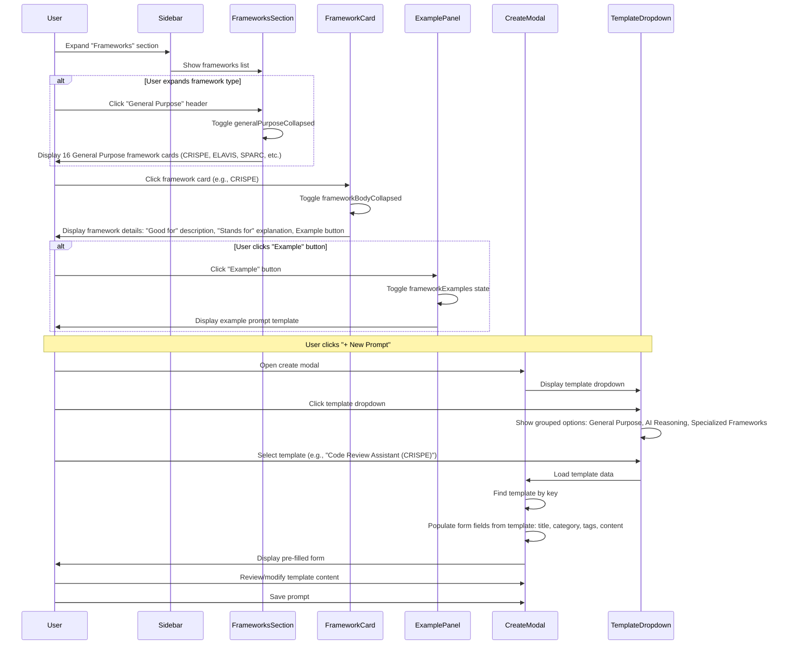

# Sequence Diagrams

## Overview

This document provides sequence diagrams for key user interactions in Prompt Vault. Sequence diagrams show the interaction between the user, UI components, and application logic over time for various workflows.

---

## Sequence Diagram 1: Creating a New Prompt

### Description
This sequence diagram shows the complete flow when a user creates a new prompt, including optional template selection and form validation.

### Key Interactions
- **Template Selection**: Optional dropdown with 27 templates
- **Form Validation**: Title and content are required fields
- **Autocomplete**: Category and tag inputs provide suggestions
- **Data Persistence**: All data saved to localStorage immediately
- **UI Update**: Prompt list refreshes automatically after save

---

## Sequence Diagram 2: Searching and Filtering Prompts

### Description
This sequence diagram shows how search, category, and tag filters work together to filter prompts in real-time.

### Key Interactions
- **Real-time Filtering**: Results update as user types or toggles filters
- **Combined Logic**: Search + Category + Tags use AND logic together
- **Tag Logic**: Multiple tags use OR logic (shows prompts with ANY selected tag)
- **Sorting**: Results sorted by modified date (newest first)

---

## Sequence Diagram 3: Import/Export Workflow

### Description
This sequence diagram shows the complete import and export process for backing up and restoring prompt data.

### Key Interactions
- **Export**: Immediate JSON download with timestamp filename
- **Import Validation**: JSON structure validation before processing
- **Duplicate Detection**: Checks title and content match
- **ID Generation**: Assigns new IDs to prevent conflicts
- **Merging**: Combines imported data with existing data

---

## Sequence Diagram 4: Viewing and Editing a Prompt

### Description
This sequence diagram shows the flow when a user views a prompt and then edits it.

### Key Interactions
- **View Modal**: Displays full prompt details with all metadata
- **Edit Flow**: Pre-fills form with existing data
- **Duplicate**: Creates copy with "(Copy)" suffix and new timestamps
- **Mark as Used**: Updates lastUsedAt timestamp
- **Delete**: Requires confirmation before deletion

---

## Sequence Diagram 5: Dark Mode Toggle

### Description
This sequence diagram shows how dark mode toggle works and persists user preference.

### Key Interactions
- **Toggle**: Switches between light and dark mode
- **Persistence**: Preference saved to localStorage
- **Theme Sync**: Syntax highlighting theme updates automatically
- **Initialization**: Preference restored on page load
- **Smooth Transition**: 200ms color transition for visual feedback

---

## Sequence Diagram 6: Template Selection and Framework Display

### Description
This sequence diagram shows how users browse and select from the template library with 27 templates covering 23 frameworks.

### Key Interactions
- **Framework Discovery**: Collapsible sections organize 23 frameworks (with 27 templates available)
- **Framework Details**: Expandable cards show "Good for" and "Stands for" info
- **Example Prompts**: Expandable examples show actual template content
- **Template Selection**: Dropdown in create modal loads template data
- **Form Population**: Template fields automatically fill form

---

## Sequence Diagram Summary Table

| Sequence Diagram | Primary User Goal | Key Components | Complexity |
|-----------------|-------------------|----------------|------------|
| Creating a New Prompt | Add new prompt with optional template | Modal, Form, TemplateDropdown, LocalStorage | Medium |
| Searching and Filtering | Find prompts quickly | SearchInput, CategoryFilter, TagFilter, FilterLogic | Medium |
| Import/Export | Backup and restore data | ExportButton, ImportModal, FileReader, Validation | High |
| Viewing and Editing | View and modify prompts | ViewModal, EditModal, Form, LocalStorage | Medium |
| Dark Mode Toggle | Change theme preference | DarkModeButton, HTML Element, LocalStorage, HighlightJS | Low |
| Template Selection | Browse and use templates | Sidebar, FrameworksSection, TemplateDropdown, CreateModal | Medium |

---

## Technical Implementation Notes

### Component Interactions
- **Alpine.js Reactive State**: All state changes trigger automatic UI updates
- **LocalStorage Operations**: Synchronous reads/writes for immediate persistence
- **Real-time Filtering**: No debouncing - filters apply instantly as user types/toggles
- **Modal Management**: Multiple modal states (showCreateModal, showEditModal, showViewModal) prevent conflicts

### Data Flow Patterns
1. **User Action** → **State Update** → **LocalStorage Save** → **UI Refresh**
2. **Filter Change** → **Filter Logic Recalculation** → **Display Update**
3. **Import** → **Validation** → **Merge Logic** → **Save** → **Refresh**

### Error Handling
- **Import Errors**: Try-catch blocks with user-friendly alert messages
- **Validation Errors**: Inline error display in form fields
- **Storage Errors**: Silent failures (localStorage quota exceeded) - export recommended

---

## Next Steps

- Validate sequences with user testing
- Add sequence diagrams for edge cases (empty states, error recovery)
- Document async operations if added (API calls, cloud sync)
- Create sequence diagrams for mobile-specific interactions

---

**Document Version**: 1.0  
**Last Updated**: 2024  
**Status**: Complete - Ready for Review

