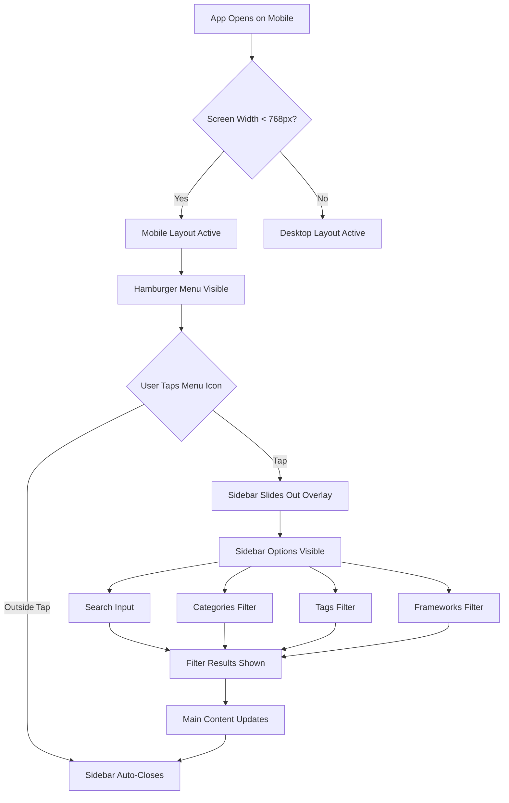
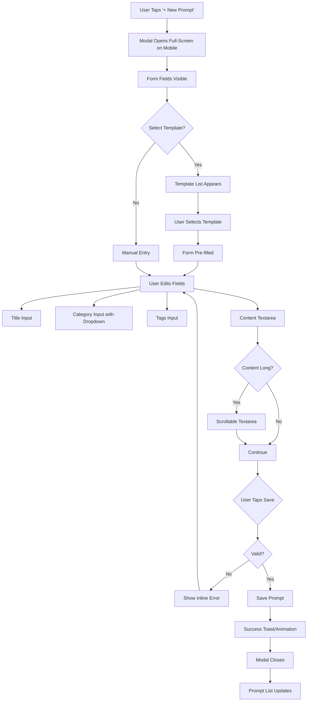
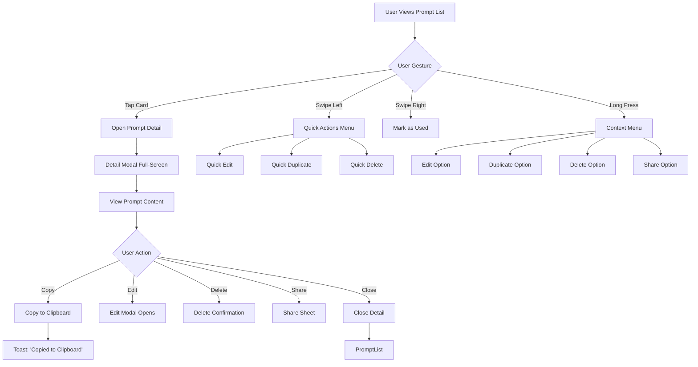
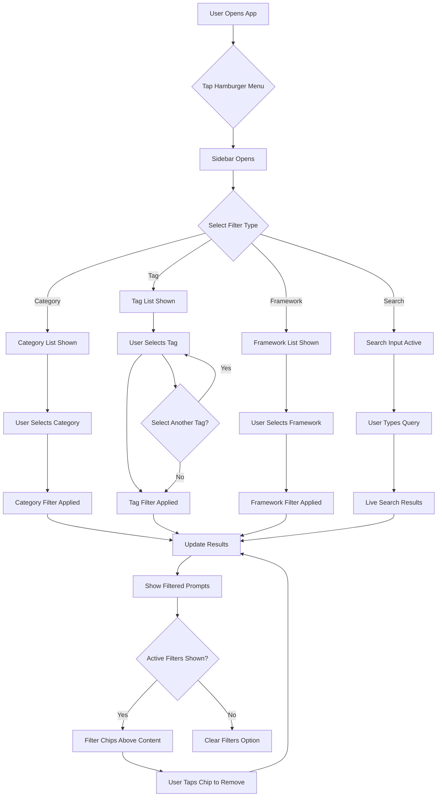

# Mobile-Friendly Design Documentation

**Document Version**: 1.0  
**Last Updated**: 2024  
**Status**: Design Specification

---

## Executive Summary

This document provides comprehensive UX design documentation for making Prompt Vault mobile-friendly. The application currently works on desktop but requires significant mobile optimization to provide an excellent user experience on smartphones and tablets. This document covers user personas, journey maps, user flows, information architecture modifications, wireframes, interaction patterns, and usability guidelines specifically for mobile devices.

---

## 1. User Personas for Mobile Context

### Mobile-Specific User Scenarios

#### Persona 1: Alex - The Mobile Power User
**Context**: Senior Developer checking prompts on smartphone during commute or quick reference

**Mobile-Specific Needs**:
- Quick access to frequently used prompts
- Fast search without typing too much
- Easy copy/paste functionality
- Swipe gestures for common actions
- Thumb-friendly navigation zones

**Pain Points on Mobile**:
- Small sidebar takes up too much screen space
- Header buttons overflow on small screens
- Modal dialogs are too large for mobile viewport
- Text input fields are difficult to interact with
- Filtering requires too many taps

**Device**: iPhone 13/14 Pro (6.1" screen) or Samsung Galaxy S23 (6.1" screen)

---

#### Persona 2: Sarah - The Mobile Content Creator
**Context**: Content creator quickly accessing prompts on tablet while working from different locations

**Mobile-Specific Needs**:
- Touch-optimized interface elements
- Easy template selection
- Quick prompt creation with voice input option
- Large, readable text areas
- Visual feedback for touch interactions

**Pain Points on Mobile**:
- Categories and tags hard to tap accurately
- Prompt cards too small to read comfortably
- Modal forms require excessive scrolling
- Export/import buttons hard to find

**Device**: iPad Pro (11" or 12.9") or Surface Pro

---

#### Persona 3: Jordan - The Casual Mobile User
**Context**: Casual user primarily accessing Prompt Vault on mobile device, occasional desktop use

**Mobile-Specific Needs**:
- Simple, intuitive navigation
- Clear visual hierarchy
- Large touch targets (minimum 44x44px)
- Simple onboarding for mobile
- Easy access to help/documentation

**Pain Points on Mobile**:
- Overwhelmed by too many options
- Doesn't know where to start
- Difficulty understanding filter system
- Accidental taps on wrong elements

**Device**: iPhone SE (5.4" screen) or budget Android phone

---

## 2. User Journey Map - Mobile Experience

### Journey Stage: Discovery & First Use (Mobile)

| Stage | User Actions | Thoughts | Emotions | Touchpoints | Opportunities |
|-------|--------------|----------|----------|-------------|---------------|
| **Awareness** | Sees Prompt Vault link on mobile browser | "Is this useful?" | Curious, hesitant | Mobile browser | Optimize first impression |
| **Landing** | Opens app on mobile | "The layout looks cramped" | Slightly frustrated | Mobile viewport | Responsive layout |
| **Exploration** | Tries to navigate sidebar | "The sidebar is blocking content" | Confused | Sidebar navigation | Mobile menu/hamburger |
| **First Action** | Attempts to create prompt | "The form is too big for my screen" | Annoyed | Create modal | Responsive modal design |
| **Completion** | Successfully creates first prompt | "This works, but could be better" | Satisfied but wanting improvement | Save button | Optimize success feedback |

### Journey Stage: Daily Mobile Usage

| Stage | User Actions | Thoughts | Emotions | Touchpoints | Opportunities |
|-------|--------------|----------|----------|-------------|---------------|
| **Open App** | Taps browser bookmark | "I need my code review prompt" | Focused | App launch | Quick access, offline support |
| **Search** | Types in search box | "Where is it?" | Slightly anxious | Search input | Autocomplete, recent searches |
| **Select** | Taps prompt card | "This is the one" | Relieved | Prompt card | Large touch targets |
| **Copy** | Copies prompt content | "Need to paste this quickly" | Efficient | Copy button | One-tap copy, clipboard integration |
| **Close** | Returns to list | "Done for now" | Satisfied | Navigation | Quick return |

---

## 3. User Flow Diagrams - Mobile Optimized

### Flow 1: Mobile Navigation Flow



### Flow 2: Mobile Prompt Creation Flow



### Flow 3: Mobile Prompt Interaction Flow



### Flow 4: Mobile Filtering Flow



---

## 4. Information Architecture - Mobile Modifications

### Current Desktop Structure
```
Header (Fixed)
├── Sidebar (Fixed 256px width)
└── Main Content (Flexible)
```

### Proposed Mobile Structure
```
Header (Fixed, Compact)
├── Hamburger Menu Icon
├── App Title (Truncated)
└── Key Actions (Essential only)

Main Content (Full Width)
├── Active Filters Bar (Sticky, if filters active)
└── Prompt Cards (Single Column)

Sidebar (Overlay/Drawer)
├── Slides in from left on menu tap
├── Full-screen overlay on small devices
└── Auto-closes on selection or outside tap
```

### Mobile Navigation Hierarchy

```
Mobile Viewport (< 768px)
│
├── Header (Sticky, 56px height)
│   ├── Hamburger Menu (44x44px touch target)
│   ├── App Title (Truncated to fit)
│   ├── Dark Mode Toggle (44x44px)
│   └── New Prompt Button (Primary action, prominent)
│
├── Active Filters Bar (Conditional, 48px height)
│   ├── Filter Chips (Removable)
│   └── Clear All Button
│
├── Main Content Area (Full width, scrollable)
│   ├── Prompt Cards (Single column, full width)
│   └── Empty State (Centered)
│
└── Bottom Navigation Bar (Optional, 56px height)
    ├── Home/List Icon
    ├── Search Icon
    ├── New Prompt Icon (Floating action button)
    ├── Filters Icon
    └── Settings Icon
```

### Tablet Navigation Hierarchy (768px - 1024px)

```
Tablet Viewport (768px - 1024px)
│
├── Header (Sticky, 64px height)
│   ├── App Title (Full)
│   ├── Action Buttons (Horizontal)
│   └── Dark Mode Toggle
│
├── Two-Column Layout (Adaptive)
│   ├── Sidebar (Collapsible, 240px when open)
│   │   └── Can be toggled open/closed
│   └── Main Content (Flexible)
│       └── Prompt Cards (2 columns)
```

---

## 5. Wireframe Descriptions - Mobile Layouts

### Wireframe 1: Mobile Home Screen (Portrait)

**Layout Structure**:
- **Header**: Fixed at top, 56px height
  - Left: Hamburger menu icon (44x44px)
  - Center: "Prompt Vault" title (truncated if needed)
  - Right: Dark mode toggle (44x44px) + "+ New" button (compact)
  
- **Active Filters Bar** (if filters active): Below header, 48px height
  - Horizontal scrollable chips showing active filters
  - "Clear All" button on right
  
- **Main Content**: Full width, scrollable
  - Prompt cards: Single column, full width minus padding (16px each side)
  - Card height: Auto, minimum 120px
  - Card spacing: 12px vertical gap
  
- **Empty State**: Centered when no prompts
  - Large icon (80x80px)
  - Heading: "No prompts yet"
  - Subtext: "Tap + New to create your first prompt"
  - CTA button: "Create Prompt"

**Interactive Elements**:
- Hamburger menu: Opens sidebar overlay
- Prompt cards: Tap to open detail view
- Swipe left on card: Quick actions menu
- Swipe right on card: Mark as used
- Long press on card: Context menu

---

### Wireframe 2: Mobile Sidebar Overlay

**Layout Structure**:
- **Overlay**: Full screen on mobile (< 640px), slide-in panel on tablet (640px+)
  - Background: Semi-transparent dark overlay (rgba(0,0,0,0.5))
  - Sidebar panel: Slides in from left, 280px width, full height
  - Close button: X icon in top-right (44x44px)
  
- **Sidebar Content** (Scrollable):
  - **Search Section**: Top, sticky
    - Search input: Full width, 48px height
    - Border radius: 8px
  
  - **Categories Section**: Collapsible
    - Header: "Categories" with chevron (44px height)
    - List: Scrollable, max height 200px
    - Each item: 48px height, full width
  
  - **Tags Section**: Collapsible
    - Header: "Tags" with chevron (44px height)
    - Tag buttons: Flex wrap, minimum 44x32px each
    - Scrollable container
  
  - **Frameworks Section**: Collapsible
    - Header: "Frameworks" with chevron (44px height)
    - List: Scrollable, max height 300px
  
- **Close Behavior**: 
  - Tap outside sidebar: Closes
  - Tap close button: Closes
  - Select filter: Closes automatically

---

### Wireframe 3: Mobile Prompt Detail View

**Layout Structure**:
- **Modal**: Full-screen on mobile (< 768px)
  - Header: Fixed at top, 56px height
    - Left: Back arrow button (44x44px)
    - Center: Prompt title (truncated)
    - Right: More options menu (44x44px)
  
  - **Content Area**: Scrollable, full width
    - Category badge: Top, 32px height
    - Tags row: Below category, flex wrap, 40px height
    - Divider: 1px, gray
    - Prompt content: Full width, padding 16px
      - Syntax highlighting toggle: Top-right of content
      - Word count: Bottom-right of content
    - Metadata section: Below content
      - Created: Date
      - Modified: Date
      - Last Used: Date (if available)
  
  - **Action Bar**: Fixed at bottom, 64px height
    - Buttons: Horizontal layout, equal width
    - Edit: Primary style
    - Duplicate: Secondary style
    - Delete: Destructive style (red)
    - Share: Secondary style (if available)

**Interactive Elements**:
- Back arrow: Closes modal, returns to list
- More options: Dropdown menu (Edit, Duplicate, Delete, Share)
- Content area: Scrollable, can copy text
- Action buttons: Large touch targets (minimum 56px height)

---

### Wireframe 4: Mobile Create/Edit Prompt Modal

**Layout Structure**:
- **Modal**: Full-screen on mobile (< 768px)
  - Header: Fixed at top, 56px height
    - Left: Cancel button (text button)
    - Center: "New Prompt" or "Edit Prompt"
    - Right: Save button (primary style)
  
  - **Form Content**: Scrollable, full width
    - **Template Selector** (Optional, at top):
      - "Start from template" toggle
      - Template dropdown: Full width, 48px height
      - Template preview: Expandable section
    
    - **Title Input**: 
      - Label: "Title" (required indicator)
      - Input: Full width, 48px height
      - Placeholder: "Enter prompt title"
    
    - **Category Input**:
      - Label: "Category"
      - Input with dropdown: Full width, 48px height
      - "+ Add new" option in dropdown
    
    - **Tags Input**:
      - Label: "Tags (comma-separated)"
      - Input: Full width, 48px height
      - Placeholder: "e.g., api, documentation, code-review"
      - Tag chips display below input
    
    - **Content Textarea**:
      - Label: "Prompt Content" (required indicator)
      - Textarea: Full width, minimum 200px height
      - Scrollable if content exceeds viewport
      - Character counter: Bottom-right
      - Syntax highlighting toggle: Top-right
    
    - **Metadata Section** (Collapsible, in edit mode):
      - Created date
      - Modified date
      - Last used date
  
  - **Keyboard Handling**:
    - Save button accessible above keyboard
    - Form scrolls to keep focused input visible

**Interactive Elements**:
- Cancel: Closes modal without saving
- Save: Validates and saves, shows success feedback
- Template selector: Opens template picker
- All inputs: Large touch targets, proper keyboard types

---

### Wireframe 5: Mobile Header Variations

**Layout Structure**:

**Variation A - Compact Header** (Default mobile):
```
[☰] Prompt Vault        [🌙] [+ New]
```

**Variation B - Expanded Header** (When menu open):
```
[←] Navigation           [Save]
```

**Variation C - Search Header** (When search active):
```
[←] [Search input...]    [X]
```

**Touch Targets**:
- All interactive elements: Minimum 44x44px
- Button spacing: Minimum 8px between buttons
- Text buttons: Minimum 48px height for comfortable tapping

---

## 6. Interaction Patterns - Mobile Optimized

### Pattern 1: Touch Gestures

**Swipe Gestures**:
- **Swipe Left on Prompt Card**: 
  - Reveals quick actions menu
  - Actions: Edit, Duplicate, Delete
  - Threshold: 30% of card width
  - Animation: Smooth slide with spring effect
  
- **Swipe Right on Prompt Card**:
  - Quick "Mark as Used" action
  - Visual feedback: Card shifts right, checkmark appears
  - Threshold: 20% of card width
  
- **Swipe Down (Pull to Refresh)**:
  - Refresh prompt list
  - Visual indicator: Spinner at top
  - Useful for syncing if cloud sync added later

**Long Press**:
- **Long Press on Prompt Card** (500ms):
  - Opens context menu
  - Haptic feedback (if supported)
  - Menu options: Edit, Duplicate, Delete, Share
  - Menu positioned near touch point

**Pinch to Zoom**:
- **Pinch on Prompt Content**:
  - Zoom in/out on prompt text
  - Useful for reading long prompts
  - Double-tap to zoom to 100%

---

### Pattern 2: Mobile Navigation Patterns

**Hamburger Menu Pattern**:
- **Trigger**: Hamburger icon (☰) in header
- **Animation**: Slide-in from left, 300ms ease-out
- **Overlay**: Semi-transparent dark background
- **Close**: 
  - Tap outside sidebar
  - Tap X button
  - Select filter (auto-close)
  - Swipe left on sidebar panel

**Bottom Navigation Pattern** (Optional enhancement):
- **Fixed Bar**: Bottom of screen, 56px height
- **Icons**: Home, Search, New (FAB), Filters, Settings
- **Active State**: Highlighted icon + label
- **Badge**: Notification count on Filters icon if active

**Tab Navigation Pattern** (Alternative):
- **Tabs**: Categories, Tags, All
- **Horizontal Scroll**: If tabs exceed width
- **Active Tab**: Underline indicator, bold text

---

### Pattern 3: Mobile Form Patterns

**Input Patterns**:
- **Focus State**: 
  - Input border changes color
  - Label animates up and scales down
  - Keyboard appears automatically
  
- **Validation**:
  - Inline error messages below input
  - Error state: Red border, error icon
  - Success state: Green checkmark icon
  
- **Auto-complete**:
  - Category dropdown: Shows suggestions as user types
  - Tag suggestions: Shows existing tags matching input

**Textarea Patterns**:
- **Expandable**: Grows as content increases
- **Scrollable**: If content exceeds viewport
- **Character Counter**: Always visible, updates in real-time
- **Syntax Highlighting**: Toggle button visible, applies on save

**Button Patterns**:
- **Primary Actions**: Prominent, high contrast
- **Secondary Actions**: Less prominent, outlined style
- **Destructive Actions**: Red color, confirmation required
- **Touch Target**: Minimum 44x44px, preferred 48x48px
- **Spacing**: Minimum 8px between buttons

---

### Pattern 4: Mobile Modal Patterns

**Full-Screen Modal** (Mobile < 768px):
- **Transition**: Slide up from bottom, 300ms ease-out
- **Header**: Fixed at top, contains title and close button
- **Content**: Scrollable area
- **Footer**: Fixed at bottom (if actions present)
- **Close**: 
  - Back button/arrow
  - Swipe down gesture
  - Tap outside (if semi-transparent overlay)

**Overlay Modal** (Tablet 768px+):
- **Transition**: Fade in with scale, 200ms ease-out
- **Position**: Centered on screen
- **Max Width**: 600px
- **Max Height**: 80% of viewport
- **Backdrop**: Semi-transparent dark overlay

**Confirmation Dialogs**:
- **Position**: Centered overlay
- **Size**: 280px width, auto height
- **Buttons**: Horizontal layout, equal width
- **Animation**: Scale in, 200ms ease-out

---

### Pattern 5: Mobile Feedback Patterns

**Toast Notifications**:
- **Position**: Top of screen (below header)
- **Animation**: Slide down, auto-dismiss after 3 seconds
- **Types**: Success (green), Error (red), Info (blue), Warning (yellow)
- **Content**: Icon + message + optional action button

**Loading States**:
- **Spinner**: Centered in content area
- **Skeleton Screens**: Show placeholder content while loading
- **Progress Indicators**: For long operations (import/export)

**Haptic Feedback**:
- **Success Actions**: Light haptic feedback
- **Error Actions**: Strong haptic feedback
- **Button Taps**: Subtle haptic feedback (if supported)

**Visual Feedback**:
- **Button Press**: Scale down to 0.95, release to 1.0
- **Card Tap**: Slight scale and shadow increase
- **Active Filter**: Highlighted background, checkmark icon

---

## 7. Usability Guidelines - Mobile-First Principles

### 7.1 Touch Target Guidelines

**Minimum Touch Target Size**:
- **Primary Actions**: 48x48px (iOS recommendation: 44x44px minimum)
- **Secondary Actions**: 44x44px minimum
- **Spacing Between Targets**: Minimum 8px (prevents accidental taps)

**Touch Target Placement**:
- **Thumb Zone**: Place primary actions in easy thumb reach
  - Bottom-right: Primary actions (right-handed users)
  - Bottom-left: Secondary actions
  - Top areas: Less frequent actions
  
- **Safe Zones**: Keep interactive elements away from screen edges
  - Minimum 8px margin from screen edges
  - Avoid placing critical actions near notch/cutout areas

---

### 7.2 Typography Guidelines

**Font Sizes** (Mobile):
- **Headers**: 24px (h1), 20px (h2), 18px (h3)
- **Body Text**: 16px minimum (prevents zoom on iOS)
- **Labels**: 14px
- **Captions**: 12px
- **Line Height**: 1.5x font size minimum

**Readability**:
- **Contrast**: WCAG AA compliant (4.5:1 for normal text, 3:1 for large text)
- **Line Length**: Maximum 75 characters per line
- **Spacing**: Adequate line spacing for comfortable reading

---

### 7.3 Layout Guidelines

**Viewport Handling**:
- **Meta Tag**: `<meta name="viewport" content="width=device-width, initial-scale=1.0">`
- **Responsive Breakpoints**:
  - Mobile: < 640px (single column)
  - Tablet Portrait: 640px - 768px (adaptive)
  - Tablet Landscape: 768px - 1024px (two columns)
  - Desktop: > 1024px (full layout)

**Content Width**:
- **Mobile**: Full width minus padding (16px each side)
- **Tablet**: Maximum 600px centered
- **Desktop**: Maximum 1200px centered

**Spacing**:
- **Padding**: 16px standard, 8px for compact areas
- **Margins**: 12px between cards, 24px between sections
- **Gaps**: 8px for small gaps, 16px for medium gaps

---

### 7.4 Performance Guidelines

**Loading Performance**:
- **Initial Load**: < 3 seconds on 3G connection
- **Time to Interactive**: < 5 seconds
- **Image Optimization**: Use appropriate sizes for mobile
- **Code Splitting**: Not applicable (single file), but consider lazy loading

**Interaction Performance**:
- **Animation Duration**: 200-300ms for transitions
- **Frame Rate**: Maintain 60fps during animations
- **Debouncing**: Apply to search input (300ms delay)
- **Throttling**: Apply to scroll events

**Battery Optimization**:
- **Avoid Heavy Animations**: Use CSS transforms instead of position changes
- **Limit Repaints**: Batch DOM updates
- **Use Passive Event Listeners**: For scroll and touch events

---

### 7.5 Accessibility Guidelines (Mobile)

**Screen Reader Support**:
- **ARIA Labels**: All interactive elements have descriptive labels
- **Landmarks**: Use semantic HTML5 elements (header, nav, main, aside, footer)
- **Roles**: Define roles for custom components
- **Live Regions**: Announce dynamic content changes

**Keyboard Navigation**:
- **Focus Management**: Visible focus indicators
- **Tab Order**: Logical tab sequence
- **Skip Links**: Provide skip to main content link

**Color and Contrast**:
- **Don't Rely on Color Alone**: Use icons and text labels
- **Contrast Ratios**: Meet WCAG AA standards
- **Dark Mode**: Ensure good contrast in both themes

**Motion Sensitivity**:
- **Respect Preferences**: Honor `prefers-reduced-motion`
- **Animation Controls**: Allow users to disable animations
- **Parallax Avoidance**: Avoid parallax effects that cause motion sickness

---

### 7.6 Mobile-Specific Best Practices

**Offline Support**:
- **Service Worker**: Consider adding for offline functionality
- **Cache Strategy**: Cache static assets
- **Offline Indicator**: Show when user is offline

**Orientation Handling**:
- **Portrait Primary**: Optimize for portrait orientation
- **Landscape Support**: Ensure usability in landscape mode
- **Orientation Lock**: Don't force orientation lock

**Keyboard Handling**:
- **Input Types**: Use appropriate input types (email, tel, url, etc.)
- **Keyboard Appearance**: Use `inputmode` attribute
- **Viewport Adjustment**: Ensure inputs aren't hidden by keyboard
- **Done/Next Buttons**: Use appropriate keyboard navigation

**File Handling**:
- **Import**: Support file picker API
- **Export**: Use download API or share API
- **File Size Limits**: Warn users about large files

**Browser Compatibility**:
- **Progressive Enhancement**: Core functionality works without JavaScript
- **Feature Detection**: Check for feature support before using
- **Fallbacks**: Provide fallbacks for unsupported features

---

## 8. Responsive Breakpoint Strategy

### Breakpoint Definitions

```css
/* Mobile First Approach */
/* Base: Mobile (< 640px) */
default styles

/* Small Mobile (640px+) */
@media (min-width: 640px) {
  /* sm: styles */
}

/* Tablet Portrait (768px+) */
@media (min-width: 768px) {
  /* md: styles */
  /* Sidebar becomes collapsible */
  /* Two-column layout */
}

/* Tablet Landscape / Small Desktop (1024px+) */
@media (min-width: 1024px) {
  /* lg: styles */
  /* Sidebar always visible */
  /* Three-column layout possible */
}

/* Desktop (1280px+) */
@media (min-width: 1280px) {
  /* xl: styles */
  /* Maximum width container */
}
```

### Layout Changes by Breakpoint

**< 640px (Mobile)**:
- Single column layout
- Full-screen modals
- Hamburger menu
- Stacked header buttons
- Single column prompt cards

**640px - 767px (Large Mobile)**:
- Single column layout
- Larger touch targets
- More spacing
- Sidebar can be overlay

**768px - 1023px (Tablet)**:
- Two-column layout (sidebar + content)
- Collapsible sidebar
- Overlay modals (not full-screen)
- Two-column prompt cards

**1024px+ (Desktop)**:
- Full desktop layout
- Permanent sidebar
- Centered modals
- Multi-column prompt cards

---

## 9. Implementation Priority

### Phase 1: Critical Mobile Fixes (High Priority)

1. **Responsive Header**
   - Stack buttons vertically or use dropdown menu
   - Reduce button sizes on mobile
   - Hide less essential buttons

2. **Mobile Sidebar**
   - Convert to hamburger menu
   - Implement slide-in overlay
   - Auto-close on selection

3. **Full-Screen Modals**
   - Make modals full-screen on mobile
   - Add proper close buttons
   - Ensure content is scrollable

4. **Touch Target Sizes**
   - Increase all button sizes to minimum 44x44px
   - Add spacing between interactive elements
   - Improve tap accuracy

5. **Single Column Layout**
   - Stack sidebar and content vertically
   - Full-width prompt cards
   - Remove fixed widths

---

### Phase 2: Enhanced Mobile Experience (Medium Priority)

1. **Swipe Gestures**
   - Swipe left for quick actions
   - Swipe right to mark as used
   - Long press for context menu

2. **Improved Navigation**
   - Bottom navigation bar (optional)
   - Tab navigation for filters
   - Breadcrumb navigation

3. **Enhanced Forms**
   - Better input handling
   - Improved keyboard navigation
   - Inline validation feedback

4. **Performance Optimization**
   - Lazy loading for prompt cards
   - Debounced search
   - Optimized animations

5. **Accessibility Improvements**
   - ARIA labels
   - Screen reader support
   - Keyboard navigation

---

### Phase 3: Advanced Mobile Features (Low Priority)

1. **Offline Support**
   - Service worker implementation
   - Cache management
   - Offline indicator

2. **Advanced Gestures**
   - Pull to refresh
   - Pinch to zoom
   - Multi-touch gestures

3. **Mobile-Specific Features**
   - Voice input for prompts
   - Share API integration
   - Clipboard API enhancements

4. **Progressive Web App**
   - PWA manifest
   - Install prompt
   - App-like experience

---

## 10. Testing Checklist - Mobile

### Device Testing

- [ ] iPhone SE (5.4" screen)
- [ ] iPhone 13/14 Pro (6.1" screen)
- [ ] iPhone 13/14 Pro Max (6.7" screen)
- [ ] Samsung Galaxy S23 (6.1" screen)
- [ ] Samsung Galaxy S23 Ultra (6.8" screen)
- [ ] iPad Mini (8.3" screen)
- [ ] iPad Pro 11" (11" screen)
- [ ] iPad Pro 12.9" (12.9" screen)

### Browser Testing

- [ ] Safari iOS (latest)
- [ ] Chrome iOS (latest)
- [ ] Chrome Android (latest)
- [ ] Firefox Android (latest)
- [ ] Samsung Internet (latest)

### Orientation Testing

- [ ] Portrait mode
- [ ] Landscape mode
- [ ] Orientation change handling

### Feature Testing

- [ ] Touch target sizes (minimum 44x44px)
- [ ] Swipe gestures
- [ ] Long press context menu
- [ ] Keyboard handling
- [ ] Modal full-screen behavior
- [ ] Sidebar overlay behavior
- [ ] Search functionality
- [ ] Filter functionality
- [ ] Create/edit prompt
- [ ] Delete prompt
- [ ] Export/import
- [ ] Dark mode toggle

### Performance Testing

- [ ] Load time < 3 seconds on 3G
- [ ] Smooth animations (60fps)
- [ ] No layout shifts
- [ ] Efficient scrolling

### Accessibility Testing

- [ ] Screen reader compatibility
- [ ] Keyboard navigation
- [ ] Color contrast
- [ ] Focus indicators
- [ ] ARIA labels

---

## 11. Success Metrics

### User Experience Metrics

- **Mobile Usage**: Increase mobile user engagement by 40%
- **Task Completion**: 90% success rate for creating prompts on mobile
- **Time on Task**: Reduce time to create prompt by 30% on mobile
- **Error Rate**: Reduce user errors by 25% on mobile

### Technical Metrics

- **Page Load Time**: < 3 seconds on 3G
- **Time to Interactive**: < 5 seconds
- **First Contentful Paint**: < 1.5 seconds
- **Largest Contentful Paint**: < 2.5 seconds
- **Cumulative Layout Shift**: < 0.1

### Usability Metrics

- **Touch Target Accuracy**: > 95% successful taps
- **Gesture Recognition**: > 90% successful gesture recognition
- **Modal Completion Rate**: > 85% successful modal interactions
- **Navigation Efficiency**: Average < 3 taps to reach any feature

---

## 12. Conclusion

This mobile-friendly design documentation provides a comprehensive guide for making Prompt Vault accessible and enjoyable on mobile devices. The key improvements include:

1. **Responsive Layout**: Adapts to different screen sizes
2. **Mobile Navigation**: Hamburger menu and overlay sidebar
3. **Touch Optimization**: Proper touch targets and gestures
4. **Full-Screen Modals**: Better mobile experience
5. **Performance**: Optimized for mobile networks
6. **Accessibility**: Screen reader and keyboard support

Implementation should follow the phased approach outlined in Section 9, starting with critical fixes and gradually enhancing the mobile experience.

---

**Document Version**: 1.0  
**Last Updated**: 2024  
**Next Review**: After Phase 1 implementation

