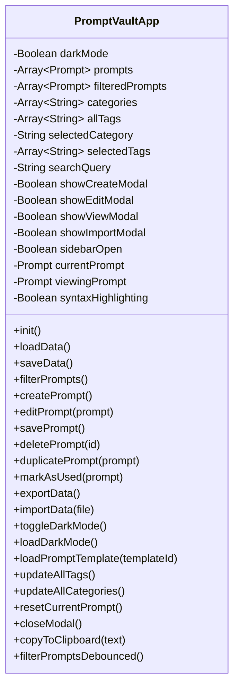
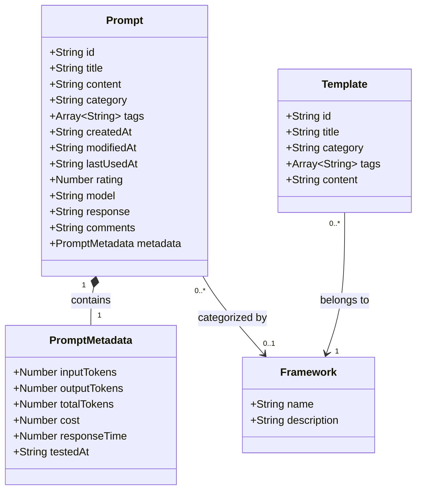
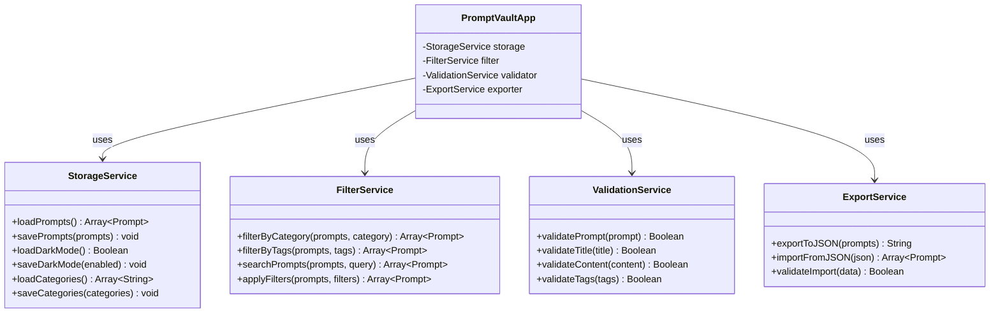
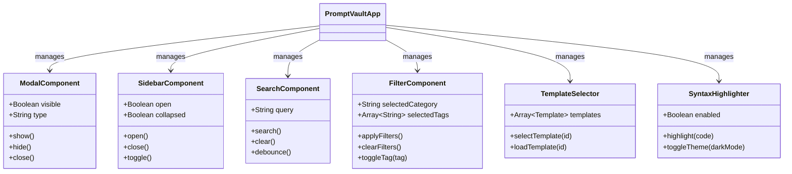
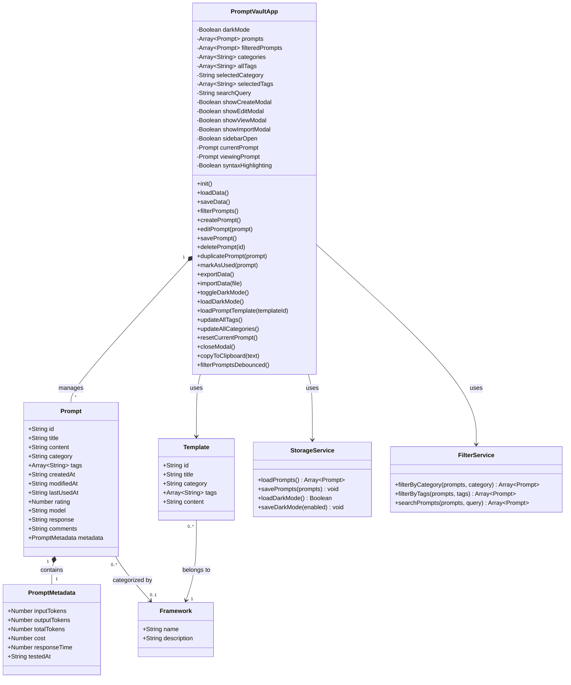
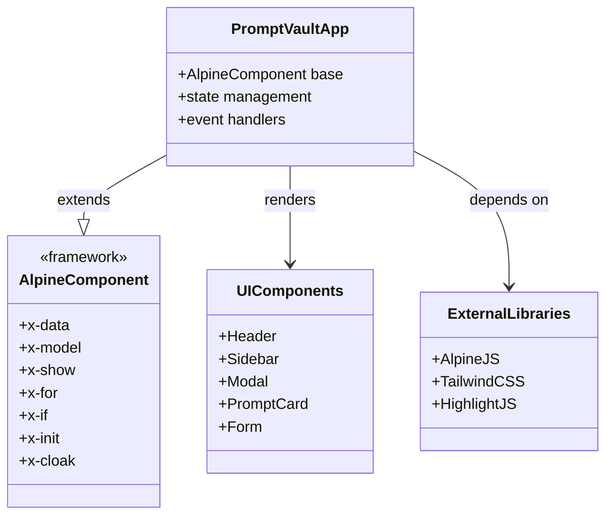
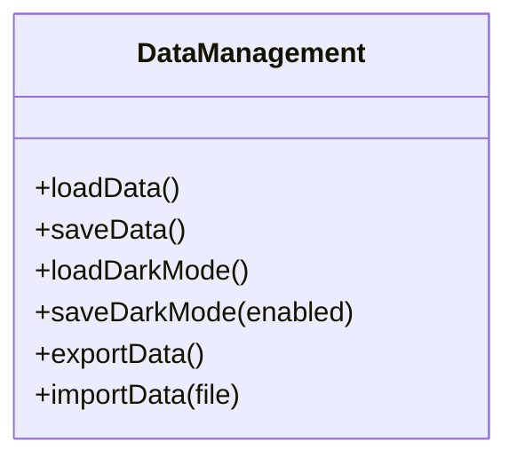
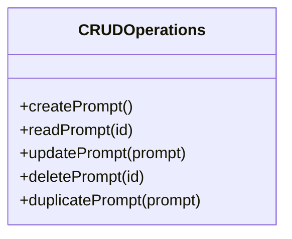
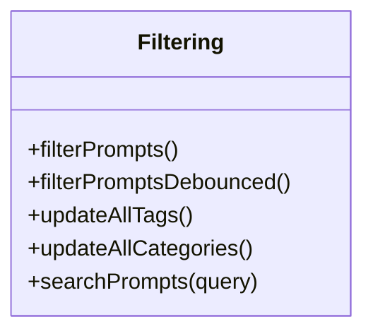
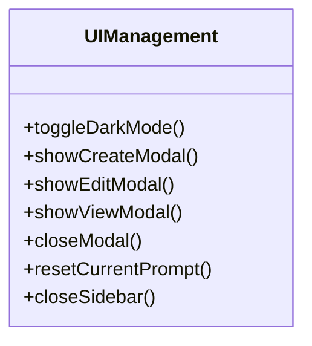

# Class Diagram

## Overview

Prompt Vault uses a component-based architecture built on Alpine.js. While not strictly object-oriented, the application can be modeled using class diagrams to represent its structure, data models, and relationships.

## Main Application Component

## Data Model Classes

## Service Layer Classes

## UI Component Classes

## Complete System Class Diagram

## Component Relationships

## Method Categories

### Data Management Methods

### CRUD Operations

### Filtering and Search

### UI Management

## Notes on Implementation

### Alpine.js Component Pattern

The application uses Alpine.js's component pattern where:
- **State**: Properties defined in the `app()` function return object
- **Methods**: Functions defined within the component object
- **Reactivity**: Automatic reactivity through Alpine's reactive system
- **Lifecycle**: `init()` method called on component initialization

### Class Equivalents

In the actual implementation:
- **Classes** → Alpine.js component data object
- **Methods** → Component methods
- **Properties** → Component state properties
- **Relationships** → Data references and method calls

### Data Flow

1. **User Action** → Triggers Alpine.js method
2. **Method Execution** → Updates component state
3. **Reactivity** → Alpine.js updates DOM automatically
4. **Persistence** → State saved to LocalStorage

### External Dependencies

- **Alpine.js**: Reactive framework
- **Tailwind CSS**: Styling framework
- **Highlight.js**: Syntax highlighting
- **Browser APIs**: LocalStorage, Clipboard API

