# Sequence Diagrams

## Overview

This document describes the main interaction flows in Prompt Vault using sequence diagrams. These diagrams illustrate how different components interact during user operations.

## 1. Application Initialization

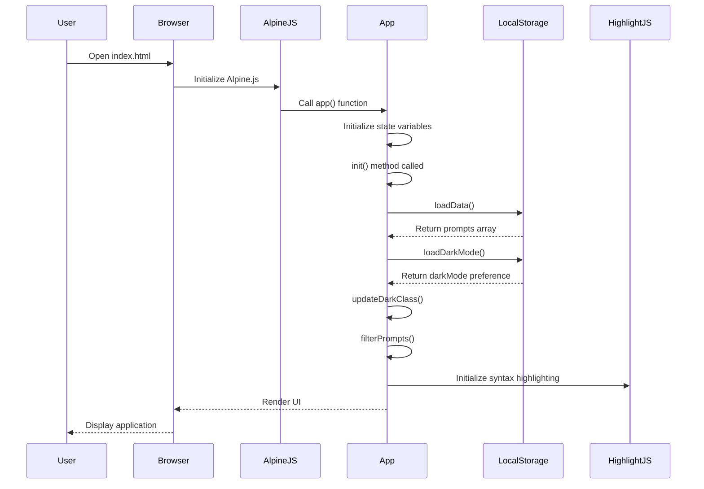

## 2. Create New Prompt

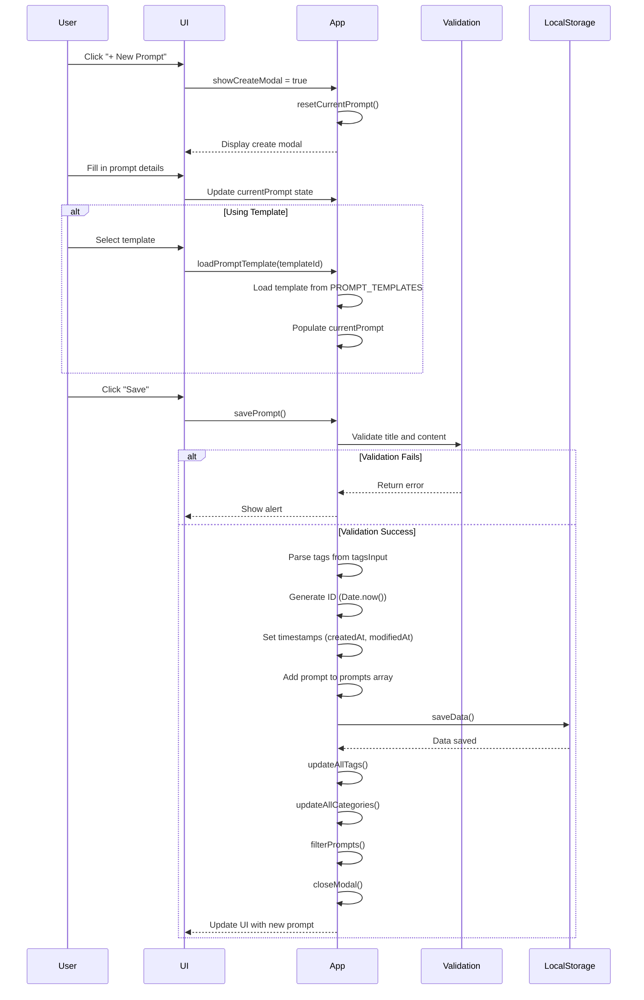

## 3. Edit Existing Prompt

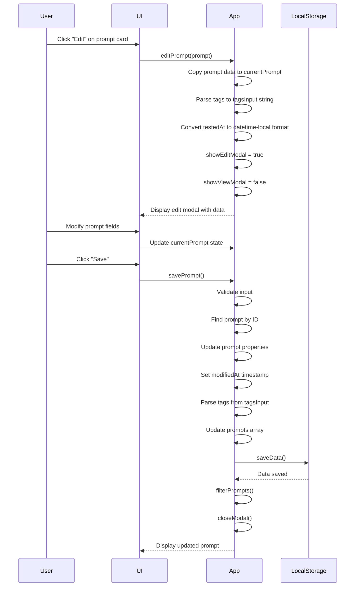

## 4. Delete Prompt

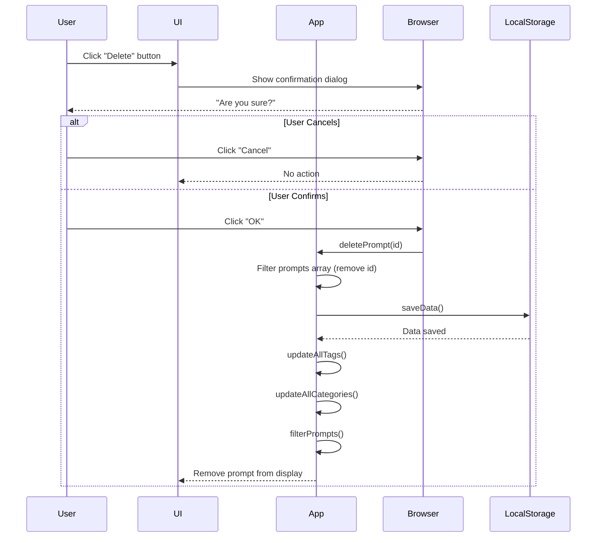

## 5. Search and Filter Prompts

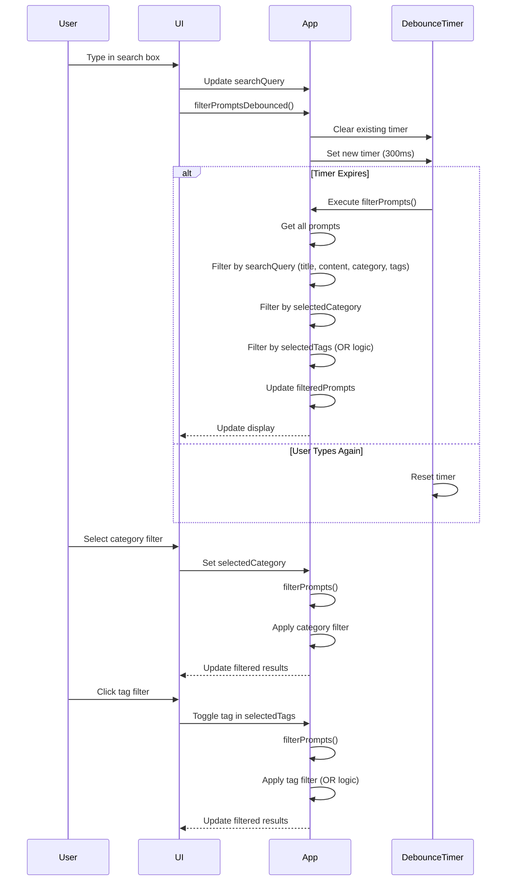

## 6. Export Prompts

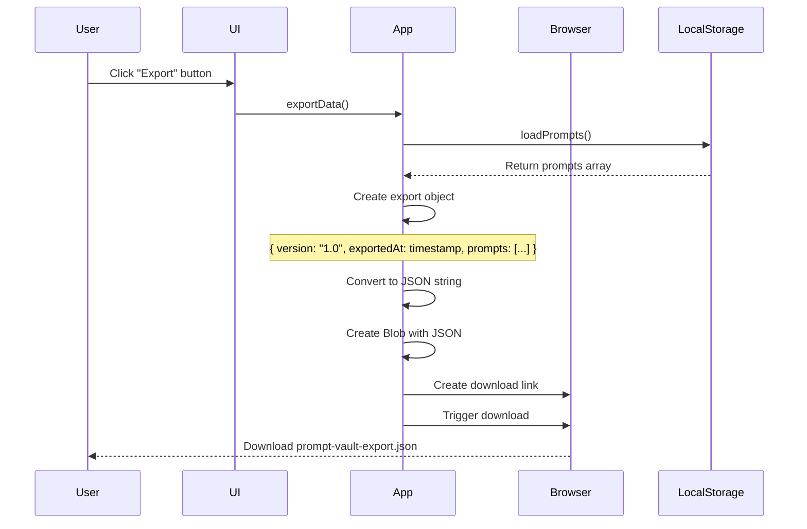

## 7. Import Prompts

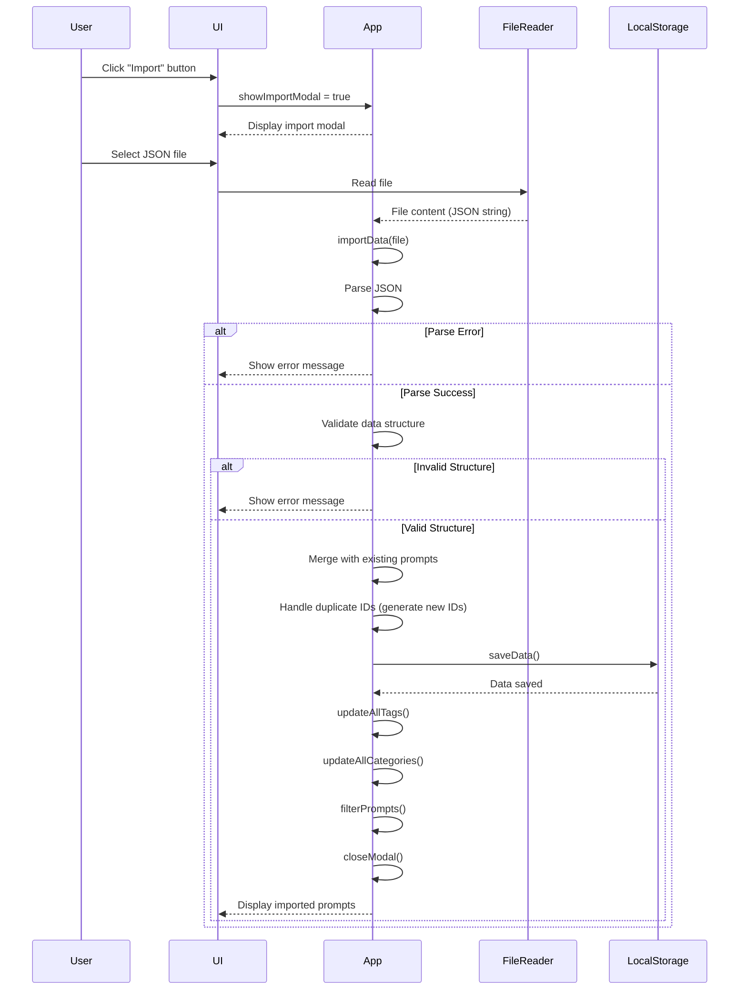

## 8. Mark Prompt as Used

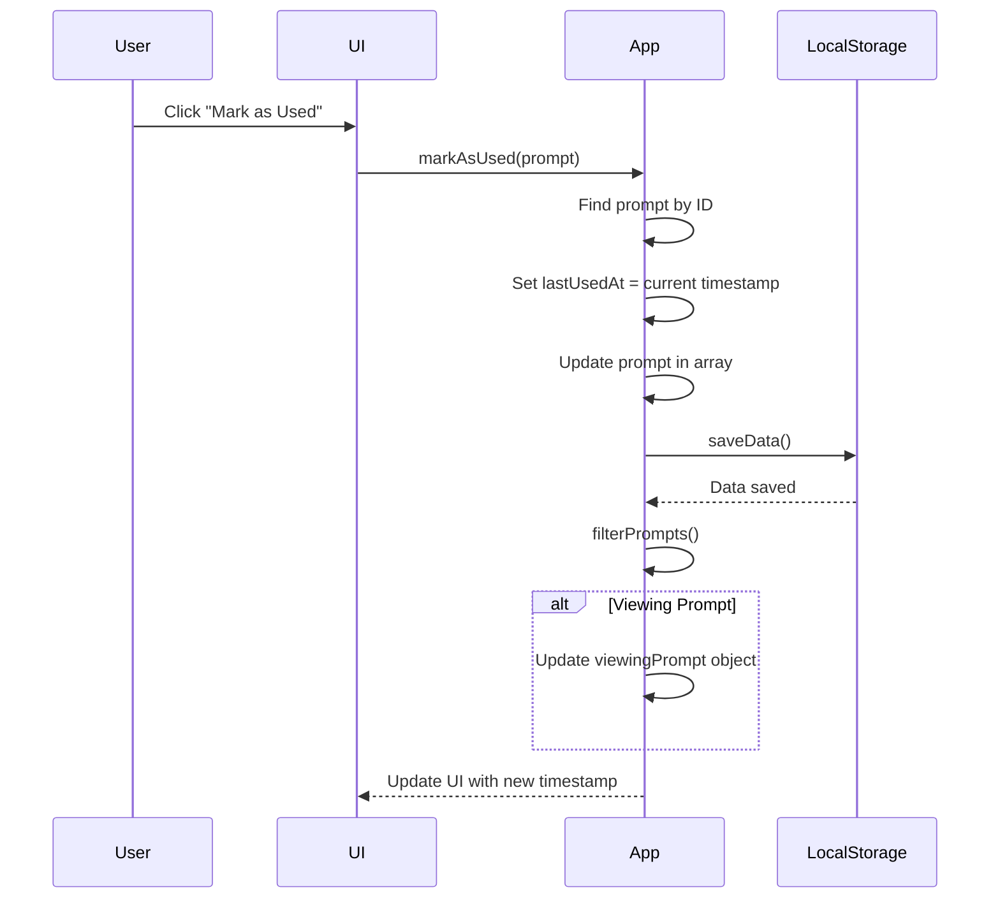

## 9. Duplicate Prompt

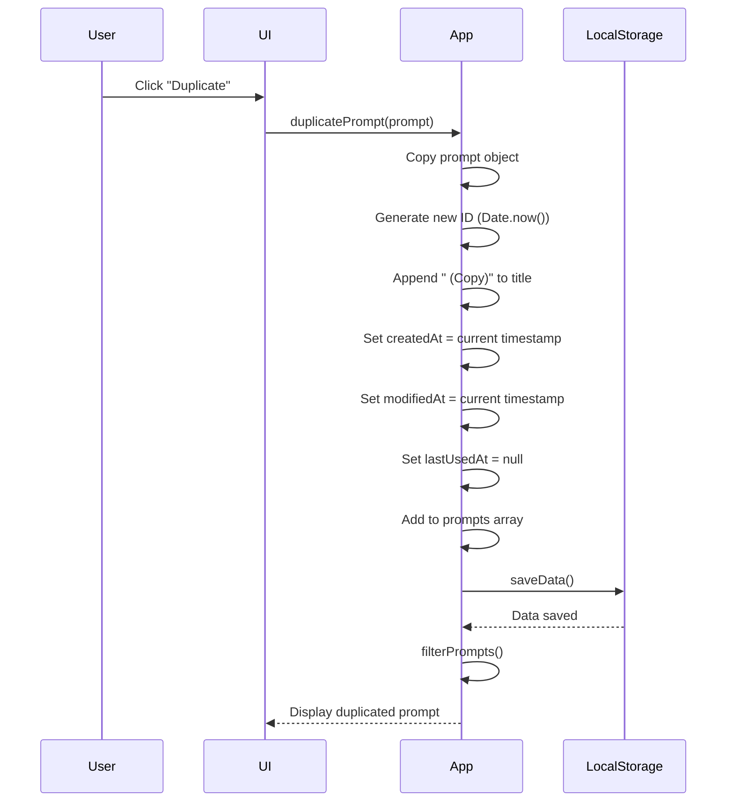

## 10. Toggle Dark Mode

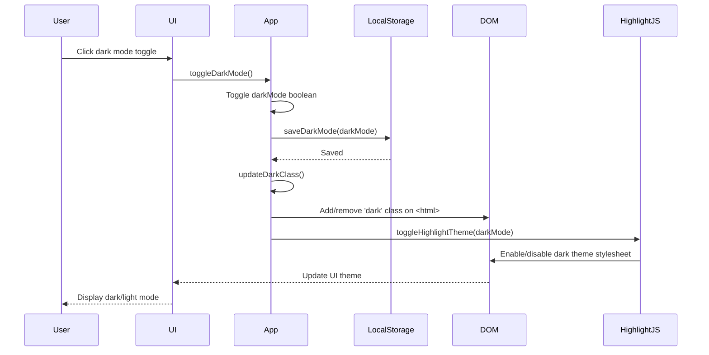

## 11. Copy Prompt to Clipboard

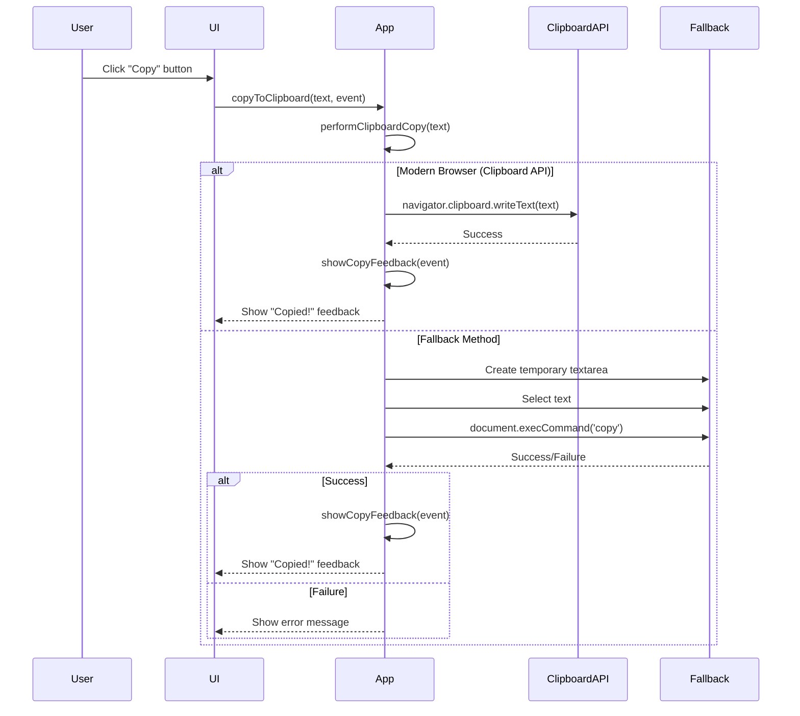

## 12. Load Prompt Template

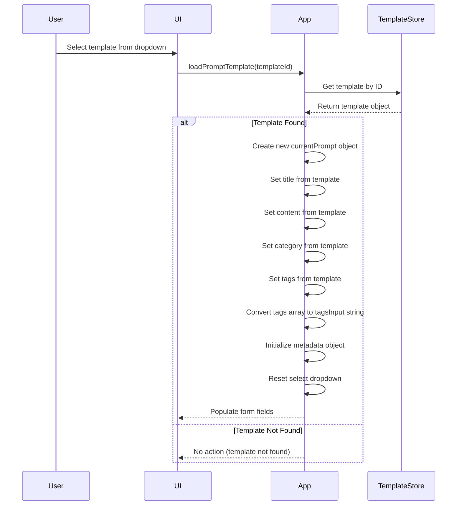

## 13. Tag Autocomplete Flow

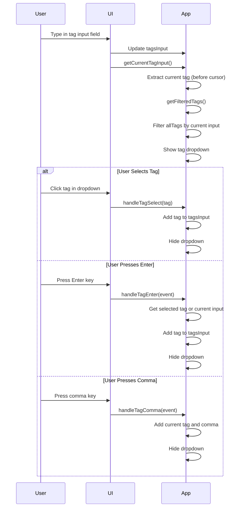

## Notes on Sequence Diagrams

### Timing Considerations

- **Debouncing**: Search operations use 300ms debounce to prevent excessive filtering
- **Async Operations**: File reading and clipboard operations are asynchronous
- **Synchronous Storage**: LocalStorage operations are synchronous but wrapped in try-catch

### Error Handling

All operations include error handling:
- **Parse Errors**: JSON parsing failures handled gracefully
- **Storage Errors**: Quota exceeded errors show user alerts
- **Validation Errors**: Invalid input prevents save operations

### State Management

- State updates trigger reactive UI updates via Alpine.js
- Multiple state updates may occur in sequence
- Final state always persisted to LocalStorage

