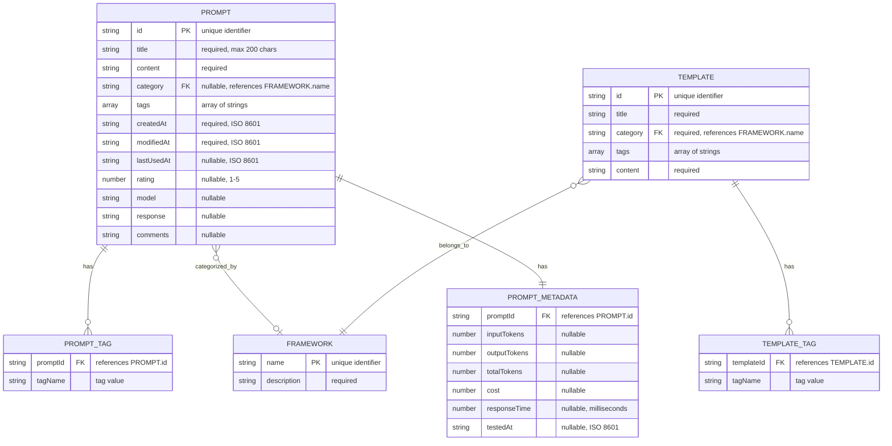

# Entity Relationship Diagram

## Overview

This document describes the relationships between entities in the Prompt Vault system using Entity Relationship Diagrams (ERD). The application uses a simple data model with relationships between prompts, frameworks, templates, and tags.

## Main Entity Relationship Diagram

## Detailed Entity Relationships

### 1. Prompt - Framework Relationship

**Relationship Details**:
- **Type**: Many-to-One (Many prompts can belong to one framework)
- **Cardinality**: 0..* to 1
- **Optional**: Yes (prompts can exist without a category)
- **Implementation**: `category` field in Prompt references Framework `name`

### 2. Prompt - Tag Relationship

**Relationship Details**:
- **Type**: Many-to-Many (Many prompts can have many tags)
- **Cardinality**: 1..* to 0..*
- **Implementation**: Tags stored as array of strings in Prompt entity
- **Note**: Tags are not normalized (stored as strings, not separate entities)

### 3. Prompt - Metadata Relationship

**Relationship Details**:
- **Type**: One-to-One (Each prompt has one metadata object)
- **Cardinality**: 1 to 1
- **Implementation**: Metadata stored as nested object within Prompt entity
- **Optional**: Yes (metadata can be null or partially filled)

### 4. Template - Framework Relationship

**Relationship Details**:
- **Type**: Many-to-One (Many templates belong to one framework)
- **Cardinality**: 0..* to 1
- **Required**: Yes (templates must have a category)
- **Implementation**: `category` field in Template references Framework `name`

### 5. Template - Tag Relationship

**Relationship Details**:
- **Type**: Many-to-Many (Many templates can have many tags)
- **Cardinality**: 1..* to 0..*
- **Implementation**: Tags stored as array of strings in Template entity
- **Note**: Tags are not normalized (stored as strings)

## Complete ERD with All Relationships

## Relationship Cardinality Summary

| Relationship | Type | Cardinality | Optional |
|-------------|------|-------------|----------|
| Prompt → Framework | Many-to-One | 0..* : 1 | Yes |
| Prompt → Tag | Many-to-Many | 1..* : 0..* | Yes |
| Prompt → Metadata | One-to-One | 1 : 1 | Yes |
| Template → Framework | Many-to-One | 0..* : 1 | No |
| Template → Tag | Many-to-Many | 1..* : 0..* | Yes |

## Data Model Implementation Notes

### Denormalized Tags

Tags are stored as arrays of strings rather than separate entities:
- **Pros**: Simpler queries, no joins needed
- **Cons**: No tag normalization, potential duplicates
- **Impact**: Tags are case-sensitive and exact-match only

### Framework Reference

Frameworks are referenced by name (string) rather than ID:
- **Pros**: Human-readable, no joins needed
- **Cons**: No referential integrity enforcement
- **Impact**: Invalid framework names allowed but filtered out

### Metadata Embedding

Metadata is stored as nested object rather than separate table:
- **Pros**: Atomic updates, simpler queries
- **Cons**: Cannot query metadata independently
- **Impact**: All metadata fields retrieved together

## Entity Attributes Detail

### Prompt Entity Attributes

| Attribute | Type | Required | Constraints | Default |
|-----------|------|----------|-------------|---------|
| id | String | Yes | Unique, Non-null | Generated |
| title | String | Yes | Max 200 chars | '' |
| content | String | Yes | Non-empty | '' |
| category | String | No | References Framework | null |
| tags | Array | No | Array of strings | [] |
| createdAt | String | Yes | ISO 8601 format | Current time |
| modifiedAt | String | Yes | ISO 8601 format | Current time |
| lastUsedAt | String | No | ISO 8601 format | null |
| rating | Number | No | 1-5 range | null |
| model | String | No | Model identifier | '' |
| response | String | No | Response content | '' |
| comments | String | No | User comments | '' |

### Framework Entity Attributes

| Attribute | Type | Required | Constraints | Default |
|-----------|------|----------|-------------|---------|
| name | String | Yes | Unique, Non-null | N/A |
| description | String | Yes | Non-empty | N/A |

### Template Entity Attributes

| Attribute | Type | Required | Constraints | Default |
|-----------|------|----------|-------------|---------|
| id | String | Yes | Unique, Non-null | Generated |
| title | String | Yes | Non-empty | N/A |
| category | String | Yes | References Framework | N/A |
| tags | Array | No | Array of strings | [] |
| content | String | Yes | Non-empty | N/A |

### Metadata Entity Attributes

| Attribute | Type | Required | Constraints | Default |
|-----------|------|----------|-------------|---------|
| inputTokens | Number | No | Positive integer | null |
| outputTokens | Number | No | Positive integer | null |
| totalTokens | Number | No | Positive integer | null |
| cost | Number | No | Positive decimal | null |
| responseTime | Number | No | Positive integer (ms) | null |
| testedAt | String | No | ISO 8601 format | null |

## Relationship Constraints

### Referential Integrity

1. **Prompt.category** → **Framework.name**
   - Not enforced at storage level
   - Validated at application level
   - Invalid categories filtered out

2. **Prompt.id** → **Metadata.promptId**
   - Enforced by data structure (nested object)
   - One-to-one relationship
   - Metadata can be null

3. **Template.category** → **Framework.name**
   - Hardcoded in application
   - Always valid

### Business Rules

1. **Prompt Creation**:
   - Must have unique ID
   - Must have title and content
   - Category must reference valid Framework (if provided)
   - Tags must be non-empty strings

2. **Prompt Update**:
   - Cannot change ID
   - Must maintain createdAt timestamp
   - Must update modifiedAt timestamp

3. **Tag Management**:
   - Tags extracted from prompts dynamically
   - Tags are case-sensitive
   - Empty tags filtered out

## Query Patterns

### Common Queries

1. **Get all prompts by framework**:
   - Filter prompts where `category = frameworkName`

2. **Get all prompts with tag**:
   - Filter prompts where `tags.includes(tagName)`

3. **Get all tags**:
   - Extract unique tags from all prompts

4. **Get all frameworks**:
   - Return predefined frameworks list

5. **Search prompts**:
   - Filter prompts where title, content, category, or tags match query

### Index Usage (Conceptual)

While LocalStorage doesn't support indexes, the application implements:
- **Category Index**: Filtered array by category
- **Tag Index**: Extracted unique tags array
- **Full-Text Index**: In-memory string matching

