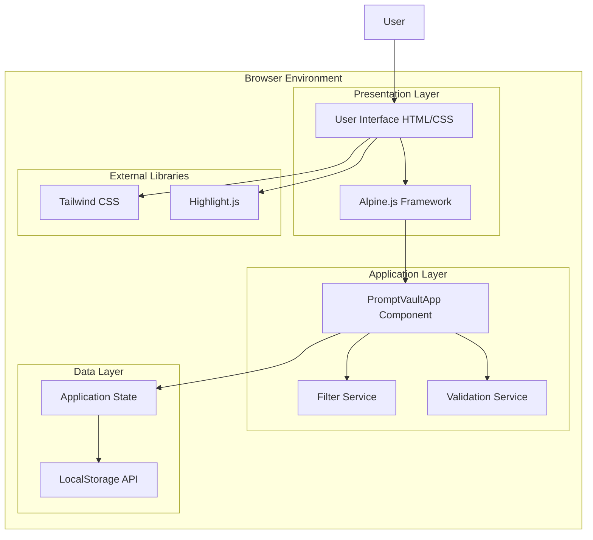
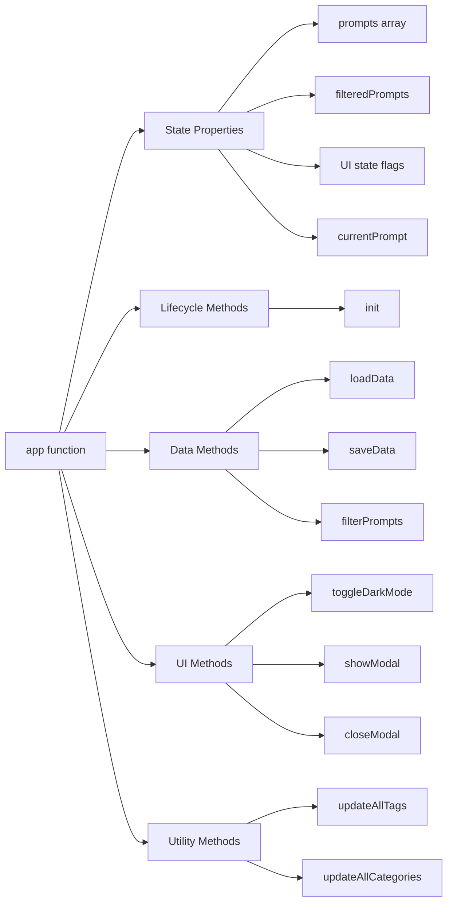
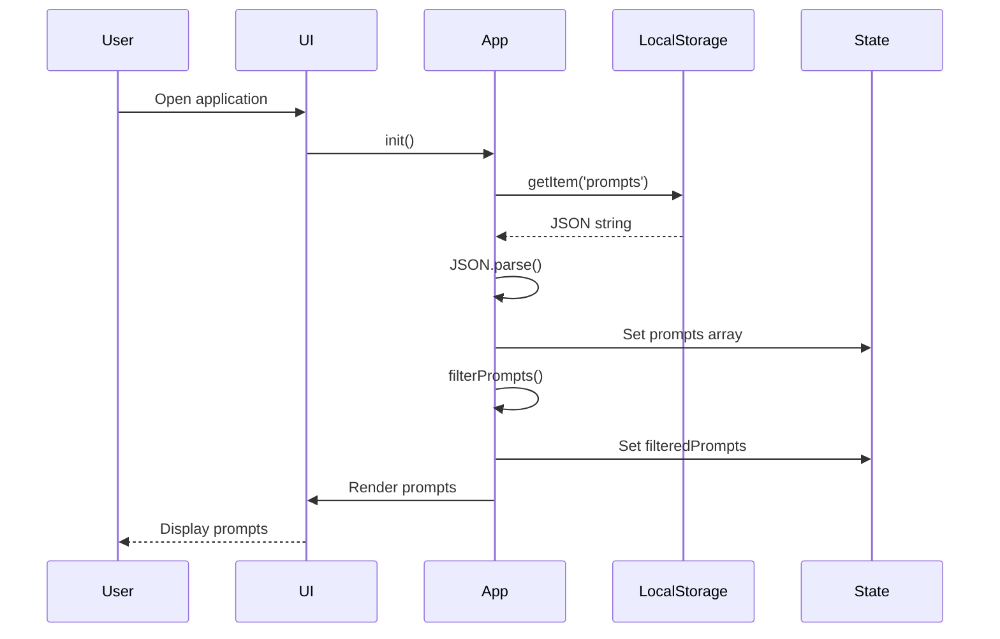
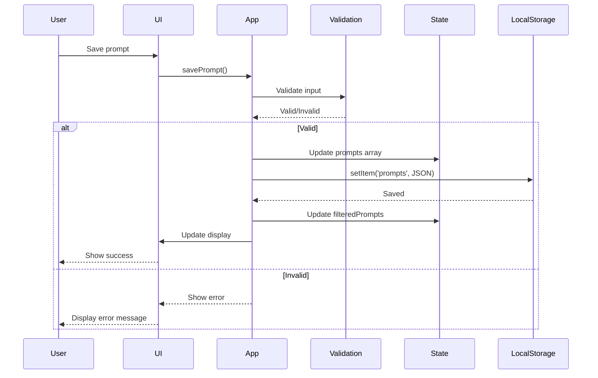
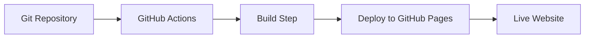

# System Architecture

## Overview

Prompt Vault is a single-page application (SPA) built with a client-side architecture. The application runs entirely in the browser with no backend server requirements. All data persistence, business logic, and user interface rendering happens on the client side.

## Architecture Diagram



## Layered Architecture

### 1. Presentation Layer

**Components**:
- HTML structure and semantic markup
- Tailwind CSS for styling
- Alpine.js directives for reactivity
- Responsive design elements

**Responsibilities**:
- Render user interface
- Handle user interactions
- Display data in various formats
- Provide visual feedback

**Technologies**:
- HTML5
- Tailwind CSS (via CDN)
- Alpine.js 3.x (via CDN)
- Highlight.js (via CDN)

### 2. Application Layer

**Components**:
- Alpine.js component (`app()` function)
- Business logic methods
- Event handlers
- State management

**Responsibilities**:
- Manage application state
- Implement business rules
- Handle user interactions
- Coordinate data operations
- Validate user input

**Key Modules**:
- **Prompt Management**: CRUD operations
- **Filtering & Search**: Data filtering logic
- **Template System**: Template loading and management
- **Export/Import**: Data serialization
- **UI State**: Modal and sidebar management

### 3. Data Layer

**Components**:
- Browser LocalStorage API
- Application state object
- Data models (Prompt, Framework, Template)

**Responsibilities**:
- Persist data across sessions
- Load data on initialization
- Save data after modifications
- Manage storage quotas

**Storage Keys**:
- `prompts`: Main data store (JSON array)
- `darkMode`: User preference (string)
- `categories`: Legacy data (deprecated)

## Component Architecture

### Alpine.js Component Structure



### Component Responsibilities

#### State Management
- **Reactive State**: Alpine.js reactive properties
- **State Updates**: Automatic DOM updates on state changes
- **State Persistence**: Save to LocalStorage on changes

#### Data Operations
- **CRUD Operations**: Create, Read, Update, Delete prompts
- **Filtering**: Search and filter prompts
- **Aggregation**: Extract categories and tags

#### UI Management
- **Modal Management**: Show/hide modals
- **Sidebar Management**: Mobile sidebar toggle
- **Theme Management**: Dark mode toggle

## Technology Stack

### Core Technologies

| Technology | Version | Purpose | Source |
|------------|---------|---------|--------|
| HTML5 | Latest | Markup structure | N/A |
| JavaScript | ES6+ | Application logic | N/A |
| Alpine.js | 3.x | Reactive framework | CDN |
| Tailwind CSS | Latest | Styling framework | CDN |
| Highlight.js | 11.9.0 | Syntax highlighting | CDN |

### Browser APIs

| API | Purpose | Browser Support |
|-----|---------|----------------|
| LocalStorage | Data persistence | All modern browsers |
| Clipboard API | Copy to clipboard | Modern browsers (with fallback) |
| FileReader API | Import functionality | All modern browsers |
| Blob API | Export functionality | All modern browsers |

## Data Flow

### Read Flow



### Write Flow



## System Boundaries

### Client-Side Only

The application operates entirely within the browser:
- **No Server**: No backend server required
- **No Network**: Works offline (after initial load)
- **No API Calls**: No external API dependencies
- **No Authentication**: Single-user application

### Browser Constraints

- **Storage Limit**: ~5-10MB LocalStorage capacity
- **Memory**: All data loaded into memory
- **Performance**: Client-side filtering and rendering
- **Compatibility**: Modern browsers only (ES6+)

## Security Architecture

### Client-Side Security

1. **XSS Prevention**:
   - Alpine.js `x-text` directive escapes HTML
   - Content sanitization for syntax highlighting
   - No `eval()` or dangerous code execution

2. **Data Privacy**:
   - Data stored locally in browser
   - No data transmission to servers
   - No tracking or analytics

3. **Input Validation**:
   - Title length validation (max 200 chars)
   - Required field validation
   - JSON parsing error handling

### Security Considerations

- **No Encryption**: Data stored in plain text
- **No Authentication**: Single-user application
- **Browser Security**: Relies on browser security model
- **Same-Origin Policy**: Data isolated per origin

## Performance Architecture

### Optimization Strategies

1. **Debouncing**: Search operations debounced (300ms)
2. **Client-Side Filtering**: Fast in-memory filtering
3. **Lazy Loading**: Templates loaded on demand
4. **Minimal Dependencies**: Lightweight libraries only

### Performance Characteristics

- **Initial Load**: ~100-200KB (HTML + CSS + JS)
- **Data Load**: Instant (LocalStorage synchronous)
- **Filtering**: O(n) complexity (acceptable for < 1000 items)
- **Rendering**: Alpine.js reactive updates

### Limitations

- **No Pagination**: All prompts loaded at once
- **No Virtual Scrolling**: Performance degrades with > 1000 prompts
- **Synchronous Storage**: Blocks UI during saves

## Deployment Architecture

### Single-File Deployment

```
prompt-vault/
└── index.html (all code in one file)
```

**Advantages**:
- Zero build process
- Easy deployment
- Simple versioning
- Quick distribution

**Deployment Options**:
1. **Local File**: Open `index.html` directly
2. **Static Hosting**: GitHub Pages, Netlify, etc.
3. **Web Server**: Any HTTP server
4. **CDN**: Content delivery network

### GitHub Pages Deployment



**Workflow**:
1. Push to `master` branch
2. GitHub Actions triggers
3. Deploy to GitHub Pages
4. Site available at `username.github.io/prompt-vault`

## Scalability Considerations

### Current Limitations

- **Data Size**: Limited by LocalStorage (~5-10MB)
- **Prompt Count**: Performance degrades with > 1000 prompts
- **Concurrent Users**: Single-user application

### Scaling Strategies

1. **Short-term**:
   - Add pagination for large datasets
   - Implement virtual scrolling
   - Add data compression

2. **Medium-term**:
   - IndexedDB for larger storage
   - Service Worker for offline support
   - Data compression and chunking

3. **Long-term**:
   - Optional cloud sync
   - Multi-user support
   - Server-side storage option

## Error Handling Architecture

### Error Handling Strategy

1. **Try-Catch Blocks**: Wrap critical operations
2. **Graceful Degradation**: Fallback to default values
3. **User Feedback**: Alert users on errors
4. **Error Logging**: Console logging for debugging

### Error Categories

1. **Storage Errors**: Quota exceeded, parse errors
2. **Validation Errors**: Invalid input, missing fields
3. **Runtime Errors**: Unexpected behavior, null references
4. **Browser Compatibility**: Feature not supported

### Error Recovery

- **Data Corruption**: Initialize with empty array
- **Parse Errors**: Log error, use default data
- **Storage Full**: Alert user, prevent save
- **Feature Unsupported**: Fallback to alternative method

## Testing Architecture

### Testing Strategy

1. **Manual Testing**: Test scripts in `/tests` directory
2. **Browser Testing**: Cross-browser compatibility testing
3. **Feature Testing**: Test individual features
4. **Integration Testing**: Test complete workflows

### Test Files

- `test.html`: Automated test suite
- `test-buttons.html`: Button functionality tests
- `test-create-prompt.js`: Prompt creation tests
- `test-script.js`: Console test script

### Future Testing Enhancements

- Unit tests (Jest/Vitest)
- E2E tests (Playwright/Cypress)
- Automated CI/CD testing

## Documentation Architecture

### Documentation Structure

```
docs/
├── technical/
│   ├── 01_Software_Objectives.md
│   ├── 02_Entity_Model.md
│   ├── 03_Database_Model.md
│   ├── 04_Class_Diagram.md
│   ├── 05_Sequence_Diagrams.md
│   ├── 06_Entity_Relationship_Diagram.md
│   └── 07_System_Architecture.md
├── UX/
│   ├── 01_User_Personas.md
│   ├── 02_User_Journey_Map.md
│   └── ... (other UX docs)
├── APPLICATION_REVIEW.md
└── TESTING_SUMMARY.md
```

### Documentation Types

1. **Technical Documentation**: Architecture, data models, diagrams
2. **UX Documentation**: User personas, journeys, flows
3. **Review Documentation**: Application reviews, testing summaries

## Future Architecture Considerations

### Potential Enhancements

1. **Modular Architecture**: Split into multiple files
2. **Build Process**: Webpack/Vite for bundling
3. **Type Safety**: TypeScript migration
4. **State Management**: External state management library
5. **Component Library**: Reusable component system

### Migration Path

1. **Phase 1**: Extract templates to separate file
2. **Phase 2**: Split into modules (data, UI, utils)
3. **Phase 3**: Add build process
4. **Phase 4**: Migrate to TypeScript
5. **Phase 5**: Add unit tests

## Conclusion

Prompt Vault uses a simple, client-side architecture that prioritizes:
- **Simplicity**: Single file, easy to deploy
- **Privacy**: All data stays local
- **Performance**: Fast client-side operations
- **Portability**: Works anywhere HTML files work

The architecture is intentionally simple to maintain ease of use while providing powerful functionality for prompt management.

